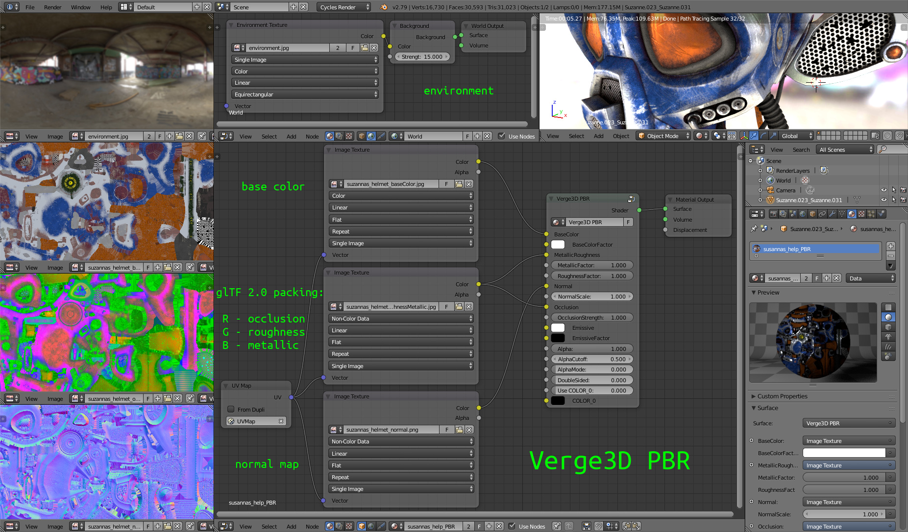

# 材质系统概述

Verge3D支持Blender中提供的以下类型的材质：

* Eevee（仅限Blender 2.8）
* Cycles（Blender 2.7及2.8）
* 符合glTF标准的PBR材质（Blender 2.7及2.8）
* 标准内部材质（仅限Blender 2.7，已弃用）
* 基于节点的GLSL内部材质（仅限Blender 2.7，已弃用）

＃

### Eevee材质

Eevee是一款实时渲染器，目前正在开发中，作为即将推出的[Blender 2.8的一部分](https://www.blender.org/2-8/#try-it-yourself)。Eevee有望成为Verge3D未来版本的主要创作工具。

可以使用Puzzles或使用**Value**或**RGB**节点的代码对材质参数进行动画处理或更改。

在Blender 2.8中，Cycles节点可与Eevee交换，因此如果您在Blender 2.7中工作，最好开始使用Cycles节点进行新项目。这将使未来的转换变得简单明了。

＃

### Cycles材质

Cycles是Blender的光线跟踪渲染器，可以在实时渲染引擎（如Verge3D）中重新创建。尽管如此，Verge3D中对Cycles的支持允许您在线移动现有的基于Cycles的资产，而不会遇到太大障碍。

可以使用Puzzles或使用**Value**或**RGB**节点的代码对材质参数进行动画处理或更改。

截至2019年2月，Verge3D并不支持所有Cycles节点。特别是，不支持以下复杂着色器：各向异性BSDF，环境遮挡，头发BSDF，保持，原始头发BSDF，原始体积，次表面散射，Toon BSDF，半透明BSDF，天鹅绒BSDF，体积吸收和体积散射。不支持以下程序纹理：砖纹理，渐变纹理，魔术纹理，Musgrave纹理和点密度。

＃

### 符合glTF标准的PBR材质

这些材质遵循物理基材质（PBR）的[glTF 2.0标准](https://www.khronos.org/news/press/khronos-releases-gltf-2.0-specification)。根据该标准，材质信息以一组纹理编码：基色，遮挡 - 粗糙 - 金属分别包装在R, G, B通道中。

在Verge3D中，符合glTF标准的PBR材质可以用基于Cycles的节点组表示，连接到PBR纹理的输入（点击下图放大）

此节点可以从存储文件**verge3d / applications / materials / pbr\_material.blend**的**NodeTree**类别中**追加**。在此过程中，确保其名称“Verge3D PBR”保持不变。

此外，虽然这不是glTF 2.0标准的一部分，但您可以将世界节点设置为环境。符合glTF标准的加载器（如Facebook News Feed）将忽略该环境。

有关如何设置符合glTF标准的PBR材质的更多信息， 请参阅[物理材质](physical-material.md)部分。

＃

### 标准材质

这些是Blender 2.7中的默认材质。它们允许调整基本设置和添加纹理。一般情况下，不建议使用标准材质，除非您做的事情很简单或只是试验。

在即将推出的Blender 2.8中，这些材质将不再可用。如果您仍然喜欢在Blender 2.7中工作，请考虑将PBR或Cycles材质用于新项目。

＃

### 基于节点的GLSL材质

这些是Blender 2.7中强大而灵活的材质。一些早期的Verge3D演示基于GLSL节点。

可以使用Puzzles或使用**Value**或**RGB**节点的代码对材质参数进行动画处理或更改。

在即将推出的Blender 2.8中，这些材质将不再可用。如果您仍然喜欢在Blender 2.7中工作，请考虑将PBR或Cycles材质用于新项目。

