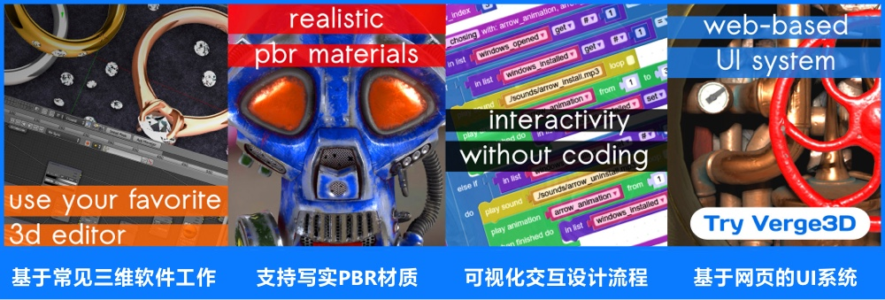

# Verge3D中文文档
[中文发行日志](releases_notes/)  

## 什么是Verge3D



> Verge3D®是一个功能强大且直观的工具包，使用Blender、Maya和3ds Max的设计师和艺术家可以使用Verge3D轻松创建基于网页的三维沉浸式体验。  
> Verge3D可用于构建交互式动画、三维互动网页、三维产品配置器、产品功能演示、交互式电子学习网站、在线三维商店、在线学习内容、报价工具、沉浸式体验，以及基于浏览器的3D游戏等。
___

## 官方网站

| **Soft8Soft** | **Verge3D中国** |
| :- | :- |
|  |  |
| https://www.soft8soft.com/ | https://verge3d.funjoy.tech/ |
| Verge3D的作者是来自俄罗斯的Soft8Soft团队，主创人员为Yuri Kovelenov和Alexander Kovelenov兄弟。 | 北京丰疆科技有限公司是Soft8Soft在中国区的技术代表，为Verge3D用户提供中文文档及中文技术支持服务。  |

## 常用链接
Verge3D用户手册（英文）： https://www.soft8soft.com/docs/  
Verge3D用户手册（中文）： https://www.soft8soft.com/docs/zh/  
Verge3D发行日志语雀镜像： https://www.yuque.com/verge3d.cn/rizhi  
Verge3D新手教程： https://space.bilibili.com/402774953/  
Verge3D中国沙盒体验地址1： https://sandbox.funjoy.tech  
Verge3D中国沙盒体验地址2： https://sandbox.eightest.com/  
浏览器WebGL性能检测（地址1）： https://www.soft8soft.com/webglreport/?v=2/  
浏览器WebGL性能检测（地址2）： https://sandbox.funjoy.tech/webglreport/?v=2/  
Verge3D代码案例库： https://www.soft8soft.com/examples/  

### 优质网络资源：

:star: 查看主流浏览器对WebGL 2.0的支持情况： https://caniuse.com/webgl2  
:star: Three.js案例库： https://threejs.org/  
:star: 免费学习Blender： https://search.bilibili.com/all?keyword=BlenderCN  
:star:  免费学习编程： https://chinese.freecodecamp.org/learn   
:star:  w3school 在线教程： https://www.w3school.com.cn/  

### Blender常用链接

Blender官方网站： https://blender.org/  
斑斓中国-Blender中国官方社区： https://www.blendercn.org/  
BlenderCN发布点： https://space.bilibili.com/164094818  
Blender清华开源镜像： https://mirrors.tuna.tsinghua.edu.cn/blender/blender-release/  
饼干教育： https://bgteach.com  
斑斓魔法CG（辣椒酱）： https://www.blendermagic.cn/

### Autodesk常用链接
Autodesk官方网站： https://autodesk.com  
Autodesk产品下载： https://www.autodesk.com/education/free-software/featured  
3ds Max下载： https://www.autodesk.com/education/free-software/3ds-max  
Maya下载： https://www.autodesk.com/education/free-software/maya
___

## 常用网页制作工具

### 所见即所得式

**Google Web Designer**（免费软件， Windows, macOS & Linux，推荐）:star:  
- [x] 官方网站： https://webdesigner.withgoogle.com/  
- [x] 百度盘链接（更新至8.2.0版）： https://pan.baidu.com/s/1-abrgUiVnnPIWlSSS58liA 提取码: ypcm  

**Webflow**（商业软件，有限免费，线上平台，订阅制，推荐）:star:  
官方网站：[https://webflow.com/](https://webflow.grsm.io/funjoy)

**Bootstrap Studio**（商业软件， Windows, macOS & Linux，推荐 ）:star:  
官方网站：https://bootstrapstudio.io/

**Pinegrow Web Editor**（商业软件， Windows, macOS & Linux，推荐）
官方网站：https://pinegrow.com/   

**Adobe Dreamweaver**（商业软件，Windows& macOS）  
官方网站：https://www.adobe.com/products/dreamweaver.html

**Adobe Animate**（商业软件，Windows & macOS ）  
官方网站：https://www.adobe.com/cn/products/animate.html

**Tumult Hype**（商业软件，macOS）  
官方网站：https://tumult.com/hype/

### 代码编辑器
> 理论上，所有的txt文本编辑器，都可以用来进行代码编辑，设计网页。  
> 我们推荐以下应用的原则基于使用时的便利性，例如HbuilderX及CodeRunner都可以直接在编辑器内部预览页面，而无需启动三维软件。关于使用此类编辑器的简单演示与介绍，详见我们的Bilibili: 

**HBuilderX** （免费软件，Windows & macOS，推荐）:star:  
```中文网络友好度高，内置预览组件，也可作为简易版的本地服务器使用。```  
官方网站： https://www.dcloud.io/hbuilderx.html

**Visual Studio Code** （免费软件， Windows, macOS & Linux，推荐）:star:  
```可安装live server插件后作为简易的本地服务器使用。```  
官方网站： https://code.visualstudio.com/

**CodeRunner**（收费软件, macOS):star:  
```强大的轻量化多语言编程IDE编辑器，可在软件内部直接预览。```  
官方网站： https://coderunnerapp.com/

**Atom** （免费软件，Windows, macOS & Linux）  
```Github开发的文本编辑工具。```  
官方网站： https://atom.io

**Sublime** （免费软件， Windows, macOS & Linux）  
官方网站： https://www.sublimetext.com/

**Notepad++** （免费软件， Windows）  
```Windows平台的老牌文本编辑器。```  
官方网站： https://notepad-plus-plus.org/

**Windows nodepad** (免费软件，Windows系统自带的文本编辑器)  
官方网站： https://www.microsoft.com/zh-cn/p/windows-notepad/9msmlrh6lzf3

### 可与Verge3D一起使用的前端框架
> Verge3D可与绝大多数前端框架一起使用，您可以直接通过HTML的方式将其嵌入到页面中，或者通过Canvas方式将其引入页面。这里推荐的是我们推荐或者验证过的前端框架，您也可以在其他前端框架中使用Verge3D。

**Vue**  (读音 /vjuː/，类似于 view) 是一套用于构建用户界面的渐进式框架。Verge3D的发行文件中附带了基于Vue的Verge3D基础模板。  
官方网站： https://cn.vuejs.org/  
Verge3D模板文档： [与react.js/vue.js集成](https://www.soft8soft.com/docs/manual/zh/programmers_guide/Integration-with-Reactjs-Vuejs.html)

**React** 是一套用于构建用户界面的 JavaScript 库。Verge3D的发行文件中附带了基于React的Verge3D基础模板。  
官方网站： https://zh-hans.reactjs.org/  
Verge3D模板文档： [与react.js/vue.js集成](https://www.soft8soft.com/docs/manual/zh/programmers_guide/Integration-with-Reactjs-Vuejs.html)

**LayUI** 是一套开源的模块化前端UI框架，。  
官方网站： https://www.layui.com/

**Angular** 是一款优秀的前端JS框架，已经被用于Google的多款产品当中。  
官方网站： https://angular.io

___

## 常用的本地服务器工具
> Verge3D应用需要网络服务器环境驱动，Verge3D App Manager本身就是一个Web Server工具。除此之外，你也可以使用其他服务器组件替代，我们为大家推荐以下常用工具：

**HFS**（免费的HTTP文件服务器，无需安装，一键可用， Windows， 不支持本地WordPress环境，推荐）  
官方网站：https://www.rejetto.com/hfs/  
本站下载：https://download.funjoy.tech/tools/hfs/HFS_2.4.0_RC7_CN.zip （2.4.0 RC7版，含中文语言文件）

**UPUPW套件**（免费软件，WAMP套件，Windows，可用于架设本地WordPress环境，推荐）  
官方网站：https://www.upupw.net/

**MAMP套件**（商业软件，有免费版本，Windows & macOS，可用于架设本地WordPress环境，推荐）  
官方网站：https://www.mamp.info/

另外，您也可以使用操作系统自带的组件来启用网络服务器，比如Windows系统环境中的IIS和macOS系统环境中的Web共享（Web Sharing），但用户体验并不是很好，不做详细介绍，您可以自行探索。

___

## Verge3D教程
### 官方英文教程+中文字幕

[Verge3D for Blender入门教程[2020]](https://www.bilibili.com/video/BV1WT4y1u7pT?share_source=copy_web)  
[Verge3D for Blender基础教程[2019]](https://www.bilibili.com/video/BV1ob411e7KC?share_source=copy_web)  
[制作3D滚动网页动画 - Verge3D for Blender](https://www.bilibili.com/video/BV1pa4y1L79t?share_source=copy_web)

[Verge3D for 3ds Max基础教程[2019]](https://www.bilibili.com/video/BV144411R7GS?share_source=copy_web)

[Verge3D for Maya入门教程[2020]](https://www.bilibili.com/video/BV1eA411i79T?share_source=copy_web)
[制作3D滚动网页动画 - Verge3D for Maya](https://www.bilibili.com/video/BV1YK4y1h7e5?share_source=copy_web)

### 官方中文教程


### 社区教程系列
[给Verge3D用户的格力特材质效果](https://www.bilibili.com/video/BV1So4y1y79R?share_source=copy_web)  
[自定义属性在Verge3D中的运用](https://www.bilibili.com/video/BV1TU4y1j7jo?share_source=copy_web)  
[给Verge3D用户的贴图随机无缝平铺讲解](https://www.bilibili.com/video/BV1Hq4y1j7kC?share_source=copy_web)  
[给Verge3D用户的纹理绘制石头演示](https://www.bilibili.com/video/BV1ag41137qU)  
[给Verge3D用户的水泥路面贴井盖演示](https://www.bilibili.com/video/BV1454y1V7wy?share_source=copy_web)  
[给Verge3D用户的材质混合蒙版讲解](https://www.bilibili.com/video/BV1HV41177wi?share_source=copy_web)  
[给Verge3D用户的基于矢量映射的多层贴图叠加讲解](https://www.bilibili.com/video/BV1jK4y1R7tv?share_source=copy_web)  
