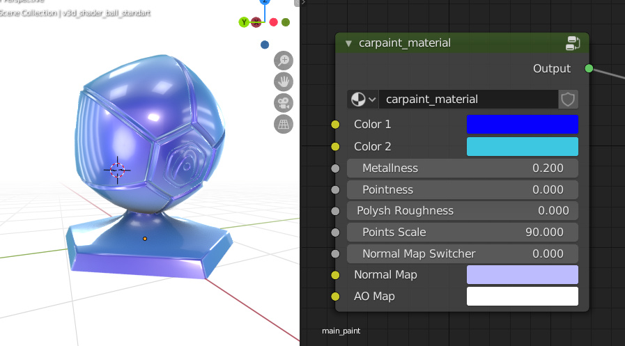

# Verge3D与材质库同步更新

> 发布时间：2020年3月17日

感谢来自用户社区的大量反馈，在此次Verge3D 3.0.1维护更新中，我们进一步优化了UI/UX，为拼图加入了新功能，支持了即将发布的Blender2.83，修复了诸多的Bug。

同时，我们为Blender和3ds Max用户发布了新版增强材质包，已购买材质库的用户可获得免费更新。

## 应用管理器与拼图编辑器

应用管理器中，上传压缩包的功能现在将包含源文件。

对暗黑主题模式下应用管理器和拼图编辑器的部分视觉元素做了优化。

更新应用、运行和保存拼图等按钮的激活状态颜色，现在更为明显。

此外，您现在也可以直接用数字小键盘的Enter键来在拼图编辑器进行确认操作了。

## 拼图

拼图**append scene（附加场景）**和**load scene（加载场景）**现在有一个字段来命名新添加的场景 (“别名”)了。您可以使用此名称访问整个场景，就当它是一个对象一样。例如，您可以使用拼图移动整个场景。

修复了加载/附加场景导致的闪烁。

在HTML类**event（事件）**拼图中添加了*fullscreenchange*选项，您可以用它来检测“进入全屏/退出全屏”模式。

消除了使用HTML类**bind element（绑定元素）**拼图时的闪烁。

修复了**create physics body（创建物理实体）**时多个物理任务的问题。

拼图**get gamepad（获取游戏手柄状态）**与VR控制器同时使用不再导致崩溃。

## Blender专属功能

Verge3D现在支持了即将推出的Blender 2.83的以下特性：

- **Vector Math**节点的新选项Sine、Cosine、Tangent和Wrap。
- **Wave Texture**节点的新选项Triangle、Phase Offset、Rings Direction和Bands Direction。
- 在Blender2.83中更改的节点**Noise**、**Vector Rotate（placeholder）**和**White Noise Texture**不再崩溃。
- 阻止在**Wave Texture**节点中类似z缓冲缝合（z-fighting）的不连续伪影。

节点Emission现在也可以正确输出alpha——因其值总是1.0，所以其强度因子只影响RGB通道。

修复了在Blender中安装Verge3D插件的问题，当Verge3D被卸载时，也会从Blender的插件列表中移除。

## 3ds Max专属功能

我们修复了 glTF 兼容材质中缺少纹理的问题。

## 其他改进和错误修复

修复了默认 HTML 事件的问题，输入范围元素现在可以工作了。

在JavaScript API 中有大量修复。

我们还修复了论坛上报告的几个错误：

> [实例化对象的对象映射问题](https://www.soft8soft.com/topic/object-mapping-issue-with-instanced-objects/)

> [纹理坐标节点的对象输出问题](https://www.soft8soft.com/topic/object-output-for-texture-coordinate-node/)

> [自发光强度为0时材质透明的问题](https://www.soft8soft.com/topic/zero-emission-materials-are-transparent/)

> [设定数值导致的背景透明失效问题](https://www.soft8soft.com/topic/transparent-background-with-set-value/)

我们终于摆脱了烦人的控制台警告 “pow(f, e) will not work for negative f”。

## 材质库

我们更新了Blender和3ds Max版本对应的[材质库](https://www.soft8soft.com/product-category/assets/)。

Blender版中新增“car paint（车漆）”材质，删除了与 Blender 2.79 兼容的传统材质包，所有材质均已已更新并重新用Blender 2.82中进行保存。

3ds Max版中也新增了“car paint（车漆）”材质，并从Blender版中移植了“velvet（天鹅绒）”和“cotton（棉布）”材质。

作为提醒，材质库中的所有材质军事可高度定制的，您只需稍改几个参数，即可轻松创建适合自己项目的特殊材质。

已购买材质库的用户，现在即可在账户面板中通过原授权链接获取新的材质包。

就这么多啦，快去[下载](https://verge3d.funjoy.tech/get-verge3d)更新你的应用吧！

——Yuri Kovelenov撰写  
——FunJoy.Tech中文翻译  
