# Verge3D 3.0 for Blender发布

> 发布时间： 2020-03-04

Verge3D 3.0发行版，如约在三月与大家见面了！在这个重要版本升级中，我们为Verge3D重建了应用管理器和拼图的用户界面与用户体验（UI/UX），及应用模板模块。应用管理器添加了许多新功能，例如上传应用压缩包，将应用文件夹删除至垃圾箱，自定义应用文件夹路径等；拼图编辑器布局做了很大的改进，扩大了工作空间，引入了黑暗主题；最后，VR模块支持了Oculus Quest和相似设备，包括其强大的控制器模块。3.0版与最新的Blender 2.82完美兼容，轻松发布3D内容到互联网。

## 应用管理器大幅改观

整个应用管理器都有了新的用户界面，应用列表的样式、文件图标都重新做了设计。相对较少使用的功能 (项目创建、模板、设置、网络管理、许可证管理、帮助链接和版本信息等) 则被移动到左侧工具栏内。

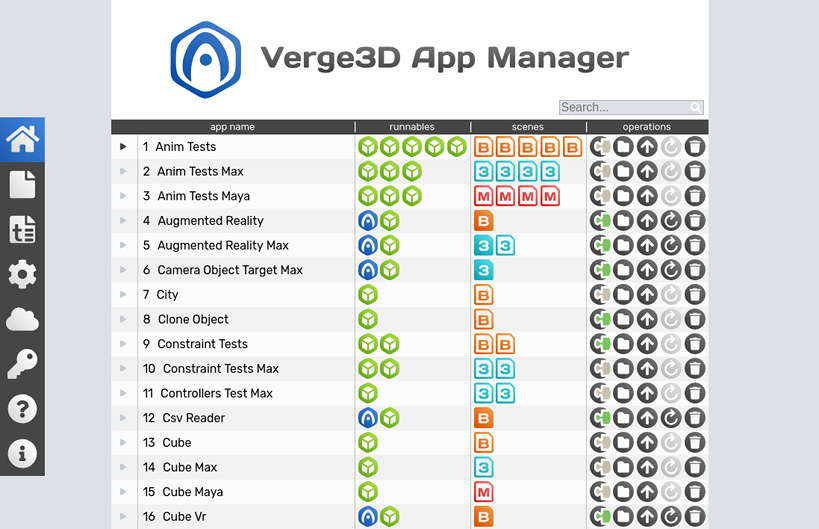

在单独的应用页面中，操作按钮全部移至右侧边栏，包括启动拼图、打开应用文件夹、将应用上传到网络、将应用zip存档上传到网络、删除和更新项目的按钮等。

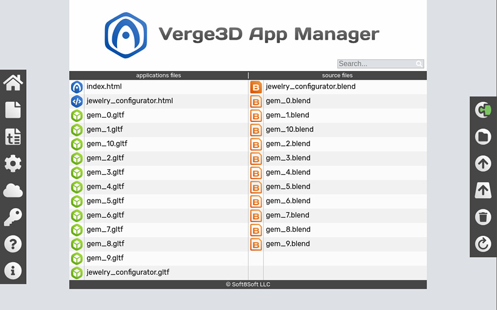

为了提高工作效率，大多数操反馈将在对话框中完成，而不是重定向到新页面。 **Esc** 键可用于快速关闭所有对话框窗口。

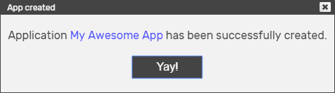

当创建一个新的应用时，应用管理器会显示指向其页面的（蓝色）链接，以免于在应用列表中寻找。如果您尝试创建已存在的应用，也将提示您导航至对应的应用页面。

对于包含许多文件的应用，现在您可以点击名称左侧的黑色三角形展开其列表，并使用了更明显的图标突显应用中的主要文件（html和场景文件）。

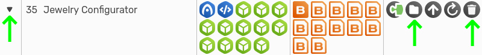

此外，在每一行中都添加了“打开文件夹”和“删除应用”的按钮。“删除” 操作将会把应用文件夹移动到系统废纸篓中，而非永久删除，从而降低操作风险。

应用列表中添加了用于筛选应用程序的搜索框。

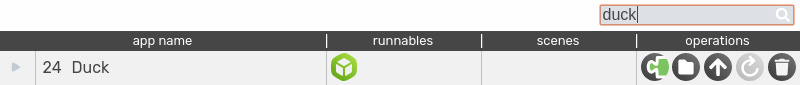

重新设计了上传到网络后反馈界面，并添加了用于复制地址到剪贴板的按钮。

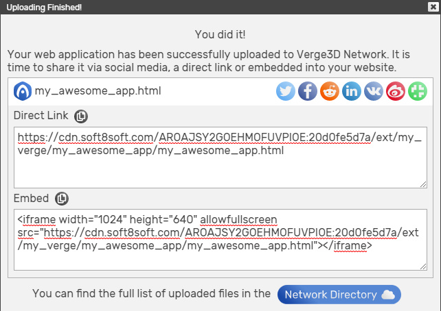

新的Verge3D云目录现以树形结构显示，更加清晰，也允许您直接删除其中的子目录。

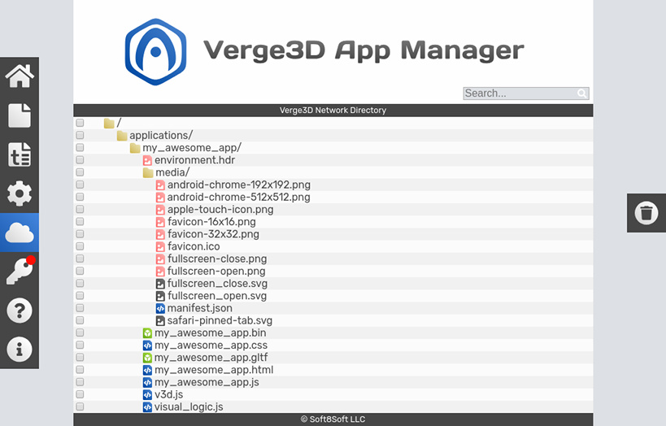

点击右侧按钮可从网络中删除选定的文件，并可通过搜索功能对列表进行过滤。

新增了上传项目压缩包的功能，方便您直接用Verge3D云与您的同事、客户或Verge3D开发人员共享整个项目。

经用户建议，新增了为应用指定自定义路径的功能，您可以将工程放在任意的其他文件夹中，而非默认**Verge3d/application**了。您的自定义路径中的应用会在列表的底部显示。打开此类应用时，浏览器地址栏中的路径添加了/ext/前缀。

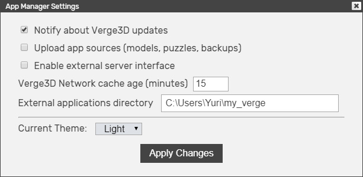

我们还向应用管理器添加了一个新设置 “上传应用源文件” (默认情况下禁用)。它允许您在上传至Verge3D云时，附带应用内的源文件 (.blend，.max，.ma.mb，拼图文件（*visual_logic.xml* ）与其备份文件夹)。

现在应用管理器的设置更改后，无需重启本地服务器。

在 “设置” 窗口中，可以切换主题（Light/Dark）。

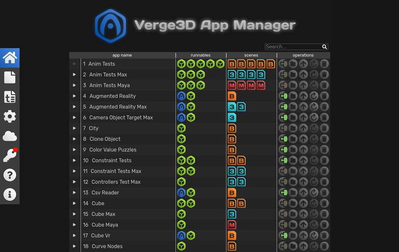

优化了文件访问性能，提升了应用管理器处理众多项目的效率。

## 拼图编辑器

我们重新设计了拼图编辑器界面、按钮图标、标签样式，为拼图添加了更美观的对话框和预加载界面（同样适配了黑暗模式）。拼图编辑器的布局做了大幅度的调整，拼图工作区现在默认全屏显示，并通过***Viewport window(视图窗口)*** 展现3D渲染结果。

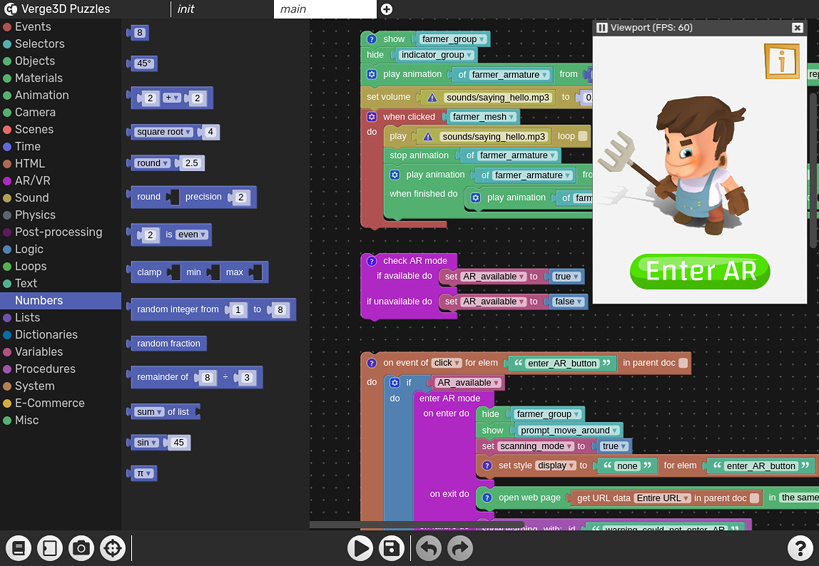

视图窗口可以自由移动、调整大小、隐藏、暂停渲染和检查帧速率。这些改变可让您更专注于拼图创作，并快速预览应用在不同分辨率屏幕上的表现。

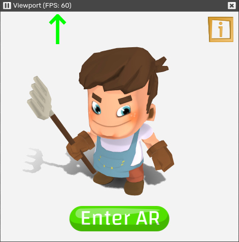

视图窗口中将以棋盘格方式显示透明背景（例如在 **configure application** 拼图中配置透明背景)。

最左下角的按钮用于切换显示系统拼图库与自定义拼图库。顺便说一下，在 **Init** 选项卡中也可以打开拼图库，同时**Init** 选项卡和其他选项卡之间现在也可以复制粘贴拼图了(请确保只使用与 Init 选项卡兼容的拼图)。

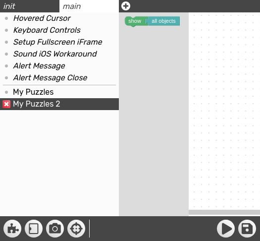

在库中添加或删除内容后不再需要刷新页面。

添加了隐藏工具箱按钮以为工作区增加更多的空间。

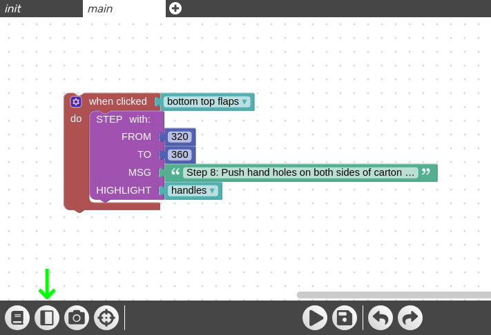

新增 **Render（渲染）按钮** ，用于隐藏与显示**Viewport Window（视图窗口）**最后一个**Center Puzzles Workplace按钮**用于置中拼图工作区。

**Run（运行）** 和 **Save（保存）** 按钮工作方式不变 (可使用 **Ctrl+空格** 快捷键运行拼图)；**undo（撤消）**、**redo(重做）** 按钮可用ctrl+z与ctrl+shift+z（或cmd+z与cmd+shift+z）快捷键操作；点击**Help（帮助）**按钮可打开相关的用户手册页面。

拼图编辑器的设置现在保存在 **Visual_logic.xml** 文件而非在浏览器的临时存储中，如果您用另一个浏览器或工作站打开拼图，可以恢复设置。

## 标准应用模板

标准模板现在由明暗 (Light/Dark)两个版本，您可以基于此选择对应的主题以适配目标网站主题。

