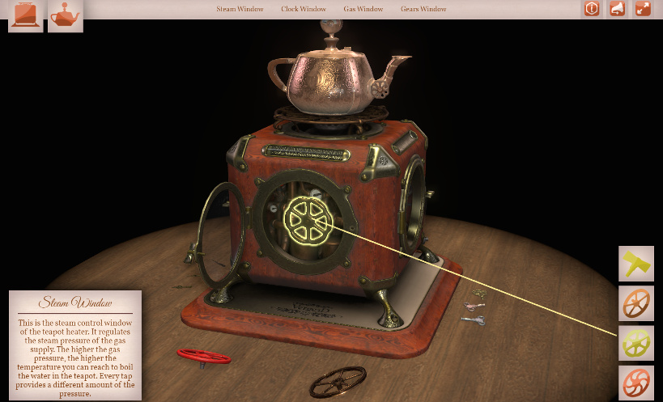
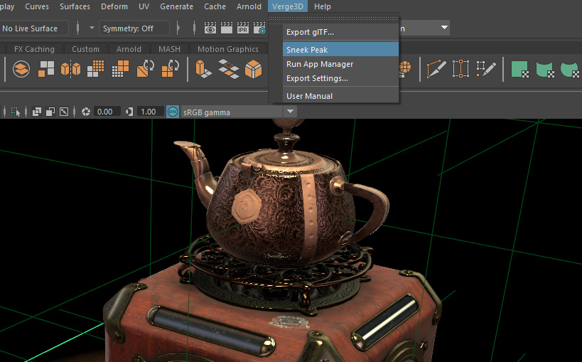
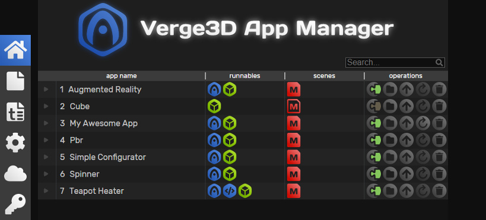
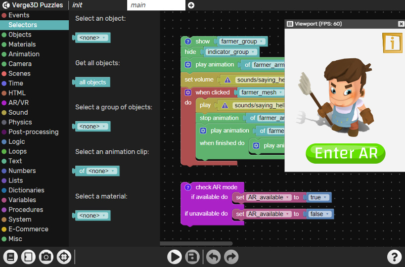
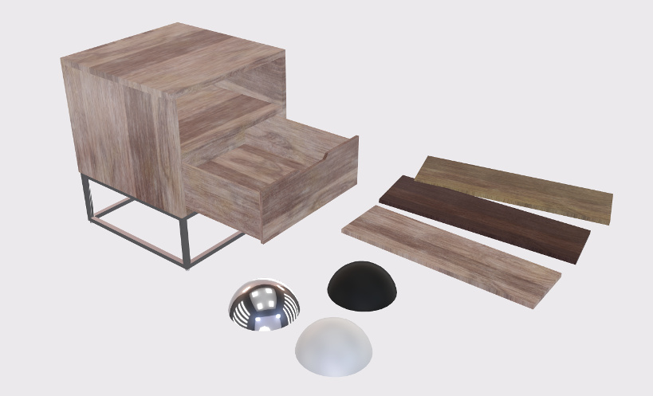
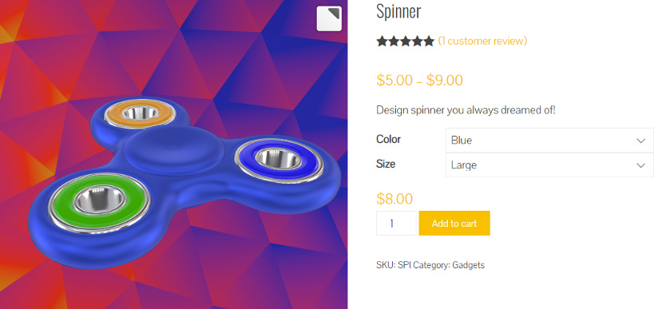

# Verge3D for Maya 正式版发布

> 发布时间：2020-03-12

Verge3D for Maya正式发布了！这是我们又一个新的里程碑！自此，Verge3D这一面向艺术家与设计师的网络互动设计工具套件，已支持Blender、Autodesk 3ds Max和Autodesk Maya三大DCC套件。

## 什么是Verge3D

有了Verge3D，设计师可以使用3ds Max、Maya及Blender等设计软件设计创作沉浸式的三维网页体验。通过使用Verge3D的可视化脚本编辑器，设计师无需任何代码编程，直接拖拽拼图模块即可创建可交互的场景。

蒸汽朋克——互动三维网页应用（茶壶加热器）

您可以通过Verge3D的云服务托管和分享应用，也可以直接将应用发布在自己的服务器上。

## 我能做什么？

Verge3D可以用于创建任何类型的交互应用，例如电商产品3D配置器或浏览器、电子互动教学课件、医疗可视化、AR/VR体验或可运行在浏览器中的3D游戏等等。下面这个视频是一些基于Verge3D创作的应用作品，快来看看吧：

此处为视频，点击链接查看：https://www.bilibili.com/video/av57175114/

<iframe src="//player.bilibili.com/player.html?aid=57175114&bvid=BV1xx41197qR&cid=99841242&page=1&high_quality=1&danmaku=0 scrolling="no" border="0" frameborder="no" framespacing="0" allowfullscreen="true" width="800px" height="600px"> </iframe>

看着很精彩吧？我们还有 [更多案例](https://verge3d.funjoy.tech/gallery/) ！

## 工具与工作流程

Verge3D在Blender与3ds Max用户中已经获得了极大的认可，并形成了简洁高效的工作流程。我们从用户反馈中总结经验，优化产品，终于将这一优化过的用户体验引入给Maya用户群体。这里是一个简单的工作流程介绍：

### glTF导出器与快速预览

在Maya中安装和启用Verge3D插件后，您可以直接将场景导出为glTF 2.0格式文件，这是当下的互联网3D图形行业标准。

Maya中的茶壶加热器应用，可从Verge3D菜单中点击Sneek Peak一键预览。

通过Sneak Peak功能，无需重复导出文件，您可以在网页浏览器中快速预览场景。

### 应用管理器与应用模板

将设计资产转换为网络优化的格式只是一个好的开始，您还需要将3D图形与HTML文件有机地结合起来，并使其功能齐备——这样才是一个可网络中随时启动的优质互联网应用。

暗黑模式下的应用管理器

Verge3D的应用管理器是为了高效、便捷地管理项目任务，通过它您可以一键创建、管理、发布3D网页应用。

### 用拼图来创作交互

现在您已经将三维资产上传至网络，那么紧接着该如何使其可交互以响应用户的操作？别担心，有了Verge3D拼图编辑器这一可视化脚本编辑环境，您可以用拖拽拼接的方式，轻松有趣地创作出复杂的行为场景。

AR小游戏的拼图模块实例

我们推荐您阅读[入门指南]([用于Maya的Verge3D：入门指南 - Soft8Soft](https://www.soft8soft.com/docs/manual/zh/maya/Beginners-Guide.html))，其中我们详尽描述了操作步骤。

## Verge3D for Maya的发行版中，都有什么内容？

简易定制器Demo

虽然这是Verge3D for Maya的第一个正式版本，但它已经功能完备，可用于生产实践了，支持的功能列表如下：

- 拥有UV、法线和切线的多边形几何体与NURBS几何体；
- PBR材质的基础色、金属度、粗糙度、环境光遮蔽、散射、透明度、法线贴图特性；
- 基于图像的照明与反射；
- HDR渲染流程；
- 具有多种播放模式的完整物体、混合形状及骨骼动画；
- 轮廓、绽放、SSAO、景深、颜色校正和其他后期处理效果；
- 环境光、面光源、点光源和聚光灯；
- 深度贴图阴影映射
- 可定制布局与主题的应用模版
- WordPress和WooCommerce集成

电商产品3D定制器（指尖陀螺Demo）

以上提到的功能，均可在Verge3D发行版中提供的案例中查看。

## 开始冒险吧！

快来[下载Verge3D for Maya](https://verge3d.funjoy.tech/get-verge3d)的无限制试用版，并开始创作您的第一个Web3D网络应用吧！欢迎您加入我们的[在线论坛](https://www.soft8soft.com/forums/)，期待能为您答疑解惑！
