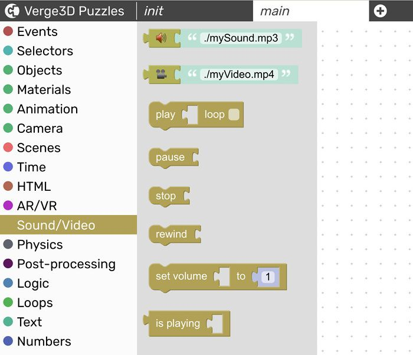
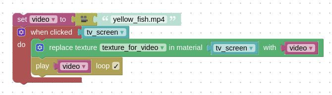
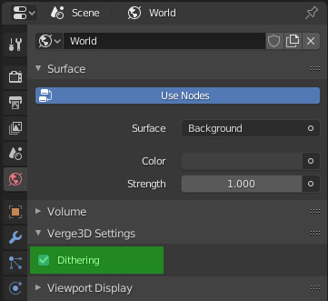
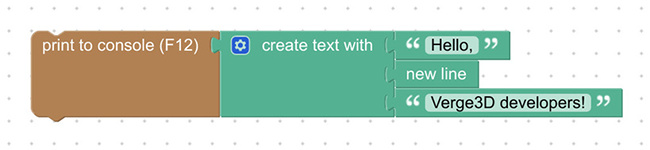
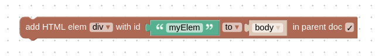

# Verge3D 3.1.1 发布

> 发布日期：2020年5月6日

此次更新修复了Verge3D 3.1 for Blender/3ds Max/Maya版中发现的一些错误。 另外带来的新功能包括：增加视频纹理，背景抖动，**new line(新行)**拼图，以及支持苹果平板电脑iPadOS系统。

## 视频纹理

现在可以拼图方式使用视频纹理了。在新命名的**Sound/Video**(声音/视频)类别中，所有的**playback(回放)**拼图，均适用于声音和视频。

查看以下案例（包含在Verge3D现有示例中）。  
https://cdn.soft8soft.com/demo/applications/video_texture/video_texture.html

<iframe width="800px" height="600px" frameborder="0" src=" https://cdn.soft8soft.com/demo/applications/video_texture/video_texture.html  " ></iframe>

本案例中使用的**load video(加载视频)**拼图，不会在您的页面上创建任何可见视频。要使视频可见，请您使用**replace texture(替换纹理)**拼图将其作为纹理分配给材质。

视频以文件的形式从app文件夹或某个远程位置进行加载。只要视频文件支持跨域请求，您甚至可以从其他域中加载它。请注意，对于HTML视频的播放，需要用户进行操作，例如单击画布，按钮或3D对象。

您还可以通过3D编辑器的材质节点/贴图，使用chroma key composing(色键合成)来创建更高级的设置。

## 更多功能

在Blender中，为**World**新增**"Dithering(抖动)"**设置。这有助于消除背景中的条纹。

**new line(新行)**拼图可用于制作多行文本。基本原理是：你不能只简单地使用**\n**符号，因为它在拼图中不起作用。除可用于通用文本之外，此拼图也可用于从Blender导出的文本对象。

与其他HTML拼图类似，**add HTML elem(添加HTML元素)** 拼图现在有了一个**in parent doc(在父文档中)**的复选框。 因此，您可以通过iframe，将新元素添加到嵌入Verge3D内容的页面。

支持了苹果平板电脑**iPadOS**系统。使用**feature available(功能可用)**拼图，可将该操作系统正确检测为移动平台。此外，您也可以在iPad上方便地查看Verge3D用户手册了。

**Verge3D Network** 现在支持跨域请求（通过[跨域资源共享](https://en.wikipedia.org/wiki/Cross-origin_resource_sharing#Simple_example)）。 例如，如果您在Soft8Soft的CDN上部署了Verge3D内容，则可以从另一个域嵌入/加载/访问它。

最后，《用户手册》跟随版本更新了进度，新增了部分内容，特别是拼图参考帮助页面的更新。此外还修订了某些样式和错别字。

## 错误修复

修复了在AR演示中，出现的某些情况下用户无法进入AR模式的问题。根本问题是，用户应始终使用**touchend**事件进入AR模式（最好使用**pointerup**），而非**touchstart**。

修复了无法删除procedure(规程)拼图的问题。

修复了桌面快捷方式启动[Verge3D Ultimate](https://www.soft8soft.com/product/verge3d-ultimate-web-interactive-suite/)时出现的错误。

修复了3ds Max导出的材质值不正确的问题。

修复了使用Blender的UV坐标节点进行对象之间共享材质时所产生的[错误](https://www.soft8soft.com/topic/strange-texture-behaviour-with-camera-moving/)。

修复了 3ds Max **Gradient(渐变)**贴图的不连续平铺设置——珠宝配置器演示现在又可以正常运行了。

拼图的**brightness/contrast (亮度/对比度)**现在可以设定为负值。

## 立即升级！

快去[下载](https://verge3d.funjoy.tech/get-verge3d)页面获取Verge3D 3.1.1 for Blender/3ds Max/Maya，升级您的3D Web交互吧！

