# Verge3D 3.1 for Blender发布

> 发布日期：2020年4月28日 

Verge3D 3.1 for Blender正式版发布了，这是一个面向艺术家和设计师友好的创建3D网络交互的工具包。在此次版本更新中带来的新功能有：更多操作VR控制器的手段，为物理引擎添加了许多新功能，为矢量操作新增了更多逻辑模块，提供了更快的基于图像的照明模式，增加了React.js和Vue.js模板，支持拼图中的HTML5指针事件，以及做了许多稳定性方面的改进。

## Blender特定功能

Verge3D现在起支持即将发布的Blender 2.83.

支持了用于创建透光效果的EEVEE节点 **Translucent BSDF**。

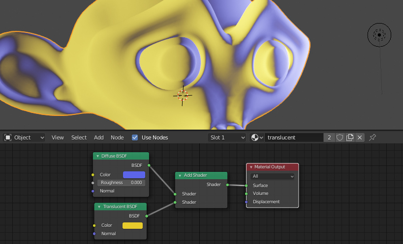

修复了一些在Blender材质中使用节点组合导致的崩溃问题（例如带有**Clear Coat**输入的**Principled BSDF**）。

对传统 GLSL 着色器的支持已从引擎中删除，这意味着从 Blender 2.79导出的场景将不再与Verge3D 3.1兼容。

在上一版本中包含但未做说明的脚本**setupAddon.bat**可以正常使用了，您可以用它在Windows上为Blender手动安装Verge3D插件。

## VR功能

虚拟现实方面现在有了新的 **traverse controllers(遍历控制器)** 和 **get controller property(获取控制器属性)** 拼图。

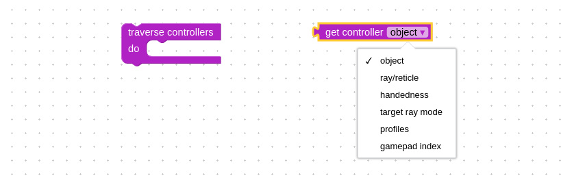

**拼图 traverse controllers(遍历控制器)** 允许您迭代所有连接的控制器 (例如 Oculus Quest 或 HTC Vive 的左右控制器)。在迭代时，您可以使用 **get controller property(获取控制器属性) 拼图**访问以下信息:

- **object(对象)** - 关联的 3D 对象名称 (这是表示控制器位置的不可见空/虚拟对象)。
- **ray/reticle(射线/十字线)** - 控制器发出的射线对象或选定物体时的十字线对象(例如，您可以通过这种方式更改线的颜色)。
- **handedness(惯用手)** - “左” 、 “右” 或 “无”。
- **target ray mode(目标射线模式)** - Cardboard设备的“gaze” 或类似 Oculus 的控制器的 “tracked-pointer”。基于此选项的功能，所以我们将 **feature available(功能可用)** 拼图的Cardboard检测去掉了。

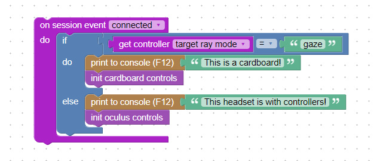

- **profiles(配置)** -区分HMD设备供应商的设备类型列表。例如，任何 Oculus Quest 控制器都将输出列表 [“oculus-touch-v2” 、 “oculus-touch” 、 “generic-trigger-squeeze-thumbstick”]。
- **gamepad index(游戏手柄索引)** - 与控制器关联的数值。您可以将此值传递给 **get gamepad property(获取游戏手柄属性)** 拼图并获取其状态，例如是否按下按钮 (通过 “按钮” 选项)，或拇指棒如何移动 (通过 “轴” 选项) 等。
  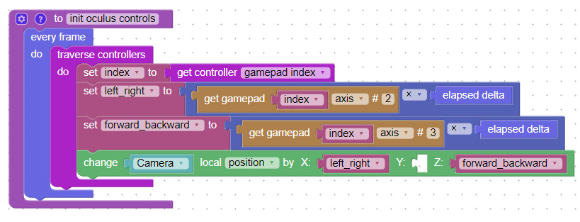

拼图 **session event(会话事件)** 有了 **connected(连接)** 和 **disconnected(断开)** 选项，可用于检测 VR 控制器的连接状态。

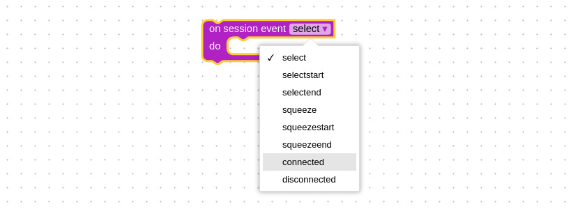

您可以使用前面提到的 **get controller property(获取控制器属性)** 拼图来检测哪个控制器已经连接或断开。通常，您应该在控制器连接后开始为其实现逻辑。

**get gamepad(获取游戏手柄)**拼图有了一个 *debug info(**调试信息)* 选项。通过它您可以了解连接的VR控制器或游戏手柄上有哪些按钮或摇杆。

现在，VR 控制器发出的射线在与某个对象相交时，会自动调整其长度。

## 物理

物理引擎支持改用浏览器原生技术 [WebAssembly](https://en.wikipedia.org/wiki/WebAssembly) (Wasm) ，这将极大提升性能，减少内存占用，并将物理引擎模块的大小减半。

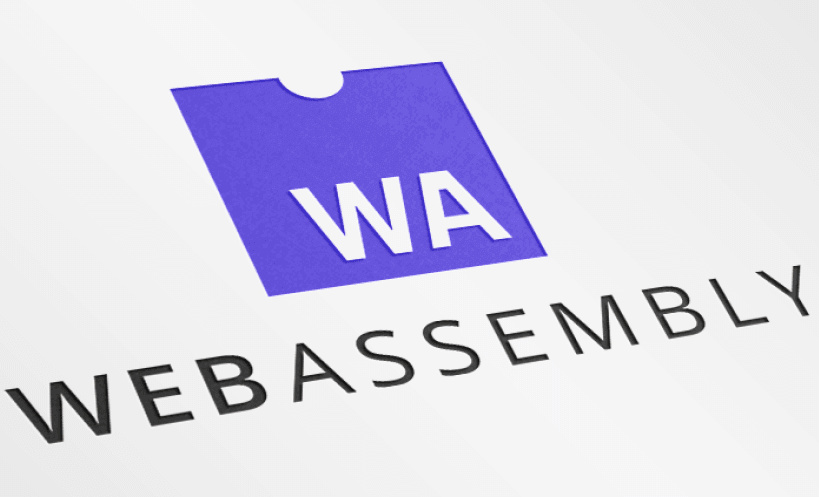

IE 11和旧版iOS Safari并不支持Wasm。因此，如果您需要针对这些浏览器开发应用物理引擎，请启用IE 11兼容模块选项。该选项将启用基于JavaScript的回退( **ammo.js** )。

增加了新拼图 **on before/after simulation(模拟前/模拟后)** ，我们建议您使用此拼图时为对象应用力/速度设置及碰撞检测。

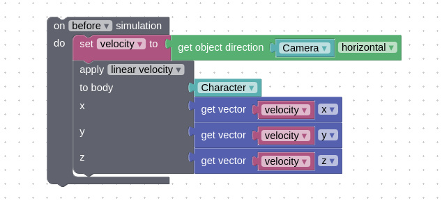

使用这个拼图的基本原理是，物理模拟和渲染时间的循环是独立运行的，会产生不同的时间增量。因此借助于此拼图，您可以更好地在这两个循环之间同步，使物理运动更加流畅，碰撞检测看起来更加精确。

如上图所示， **get object direction(获取对象方向)** 拼图现在可以返回水平方向的矢量。这简化了第一人称视图中的导航。

增加了一个新的非常有用的拼图 **body control(实体控制**)。

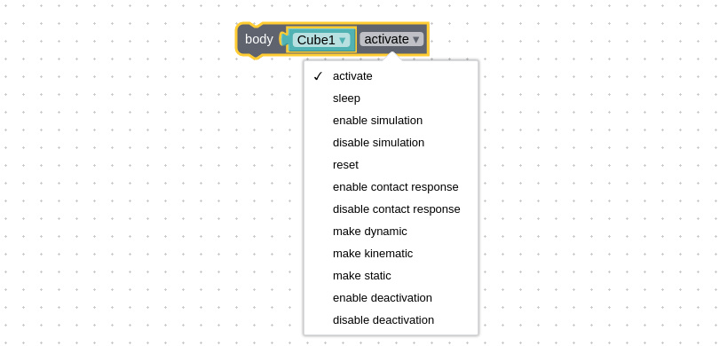

有了这个拼图，你可以覆盖物理实体的状态，例如迫使它成为静态，运动或动态，禁用和恢复物理模拟，重置其力/速度, 让它休眠，等等。

其可用场景之一：您可以通过此拼图来用VR控制器抓取物体，并把它扔出去。

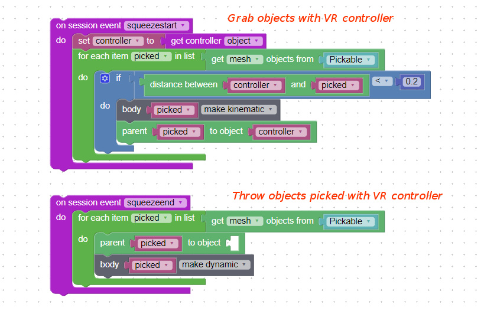

从现在开始，所有物理对象在一段时间不活动后都会进入休眠模式，为您的应用节省性能。如果对象与某些东西碰撞则会被激活，或者如果您特意使用上述 **body control(实体控制)** 拼图去激活它。

实现了*幽灵(**ghost**)*物理对象。

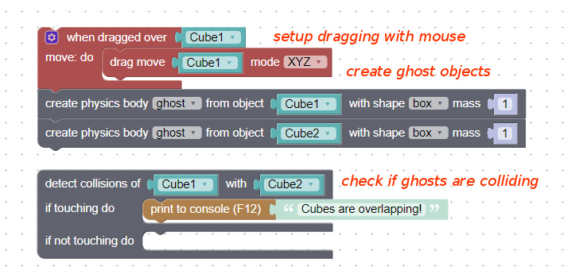

其可用场景之一: 检测拖动的物体 (如房间里的家具模型) 是否重叠，或按下 VR 控制器的按钮等。

为**apply vector（应用向量）拼图**增加了**angular factor（角因数）**和**linear factor（线性因数）**两个选项。使用这两个新选项，您可以为物理对象限制某个轴的运动（通过赋予0值给指定轴）。

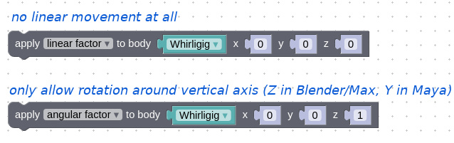

可能的用例包括各种陀螺和摇摆，但您也可以使用此拼图来实现其他物理特征。

除了以前可用的动态和静态网格物体外，现在还支持运动学网格（Kinematic mesh）和残影网格（ghost mesh）物体。

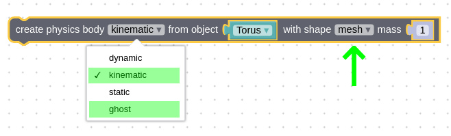

## 新功能

**数字｜Numbers** 类添加了使用矢量操作的拼图，即 **create vector(创建矢量)，** **set/get vector value(设置/获取矢量值)**和 **vector math(向量数学)。**

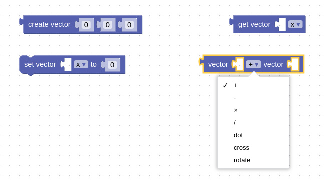

增加了新的拼图**clone animation（克隆动画）**。使用此拼图，您可以从一段长动画中截取片段，并作为新的片段使用（通常用于角色动画）。

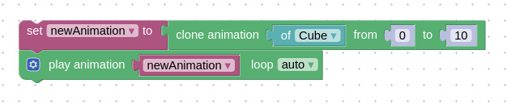

增加了新的拼图**stop sound（停止声音）**。除停止播放外，也将声音倒回开始。

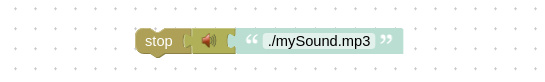

现在可以使用拼图将非蒙皮对象的材质应用于蒙皮对象了。

## 基于图像的照明

这是一个重要的性能调整改进。从现在开始，您可以选择基于图像的照明算法。过去只可以使用有预过滤的 Mipmaped 辐射环境贴图 (PMREM) ——它可以产生高质量的渲染，但速度相当慢。新版本引入了两种基于light probes的更简单快速的技术，可以在Blender的**渲染**选项卡中找到：

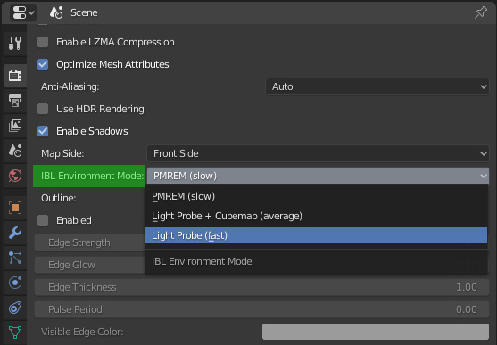

- **PMREM** - 高质量，速度慢。这是默认选项。
- **Light Probe + Cubemap** - 降低基于图像的镜面反射质量，平均性能。
- **Light Probe** - 不使用基于图像的镜面反射，速度最快 (可能比 PMREM 快 10 倍)。

因此，如果您的应用有性能问题（低FPS），可以尝试通过切换到Light Probe技术来改善此问题。此外，在Blender中，您可以更换**Principled BSDF**节点为**Diffuse BSDF**或**Emission BSDF**节点来作为进一步的优化。

此外，用户对环境贴图大小的设定现在可以在Verge3D应用中实现了 (间接光照明Indirect Lighting -> 立方体反射Cubemap Size尺寸)。

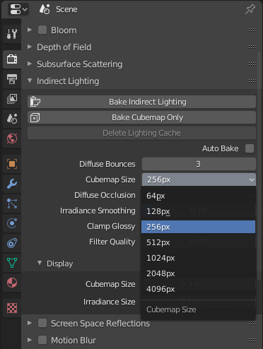

使用该设定可以有效提高反射质量，但会消耗大量内存和并造成性能下降。 我们建议大多数场景使用256像素即可，如果您需要更好的反射质量（例如渲染珠宝）可设置为512像素。

## 指针事件

用于处理浏览器中输入设备的指针事件拼图现在采用了[最新标准](https://developer.mozilla.org/zh-CN/docs/Web/API/Pointer_events), 为**HTML event(HTML事件)** 拼图添加了**Pointerdown** , **Pointerup** , **Pointermove**等事件类型。

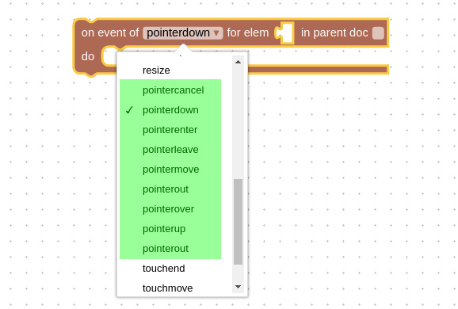

拼图 **get event property(获取时间资产)** 新增 [isPrimary](https://developer.mozilla.org/en-US/docs/Web/API/PointerEvent/isPrimary)(例如，检测多点触摸事件的第一根手指) 和 [pointerType](https://developer.mozilla.org/en-US/docs/Web/API/PointerEvent/pointerType)(鼠标、触控笔或触摸) 选项。

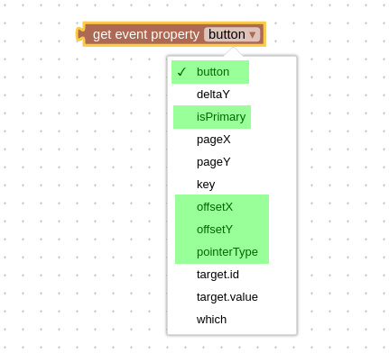

我们也为此拼图新增了一些其他相关的事件属性：**button**， **offsetX** 和 **offsetY 。**其中**button**为鼠标按键，其值对应关系：0 - 左键，1 - 滚轮，2 - 右键，3 - 回退，4 - 前进。3、4按键仅限多键鼠标。

> 参见：https://developer.mozilla.org/zh-CN/docs/Web/API/MouseEvent/button
>
> **MDN Web docs**

## React / Vue

引入了新的应用模板，Verge3D现在可以更容易地与[React.js](https://reactjs.org/) 和 [Vue.js](https://vuejs.org/) 应用集成。有关详细信息，请参阅本[指南](https://www.soft8soft.com/docs/manual/zh/programmers_guide/Integration-with-Reactjs-Vuejs.html)。

## 其他改进

WebGL 画布容器元素的 id 从简单的 “container” 更改为更明显的 “v3d-container”。如果您的项目中已经依赖此名称，请确保及时更新代码。

安装新版Verge3D到旧版同一目录时，已保存的拼图库文件**my_library.xml**将不会被覆盖。

对WebGL着色器做了一些优化，现在它们的编译速度提高了20～25%，有助于改进场景加载效率。

在JavaScript方法中，为Color类添加了**CopyRGBEToLinear()**和**ConvertRGBEToLinear()**。

更新并扩展了文档。更新的部分包括物理、照明和渲染 (适用于所有3个DCC套件)，以及新的和以前实现的拼图的帮助页面。

## 错误修复

修复了一个与非节点材质相关的罕见问题。

修复了当VR控制器的父对象离开摄影机一段时间后会消失的错误。

修复了这些论坛主题中报告如下错误：

> [安全性错误](https://www.soft8soft.com/topic/securityerror-the-operation-is-insecure/)
>
> [字典检查指定键拼图错误](https://www.soft8soft.com/topic/dict-check-key-typeerror/)
>
> [未使用贴图导出问题](https://www.soft8soft.com/topic/verge3d-3-1-pre1-available/)

修复了**screen-space reflection(屏幕空间反射)**拼图中的[错误](https://www.soft8soft.com/topic/parts-frozen-when-switching-cameras/)**。**

修复了**飞行摄影机**或**第一人称摄影机**是某个对象的子物体时引起的错误。

修复了**is visible(可见)**拼图在某些情况不可用的问题。

修复了一系列因Windows用户名包含空格或非拉丁字母导致的安装错误问题。

修复了光线投射应用于已隐藏的父对象的错误，这些对象现在会被忽略。

我们修复了拼图中的各种由自动代码检查器发现的小错误。

## 立即升级！

就这么多啦，快去[下载](https://verge3d.funjoy.tech/get-verge3d)更新你的应用吧！

