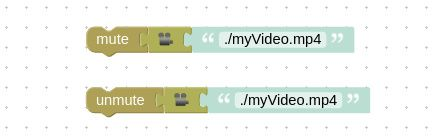

# Verge3D 3.2 for Maya发布

> 发布时间：2020年6月24日

Verge3D for Maya的最新版本已经发布。在3.2版中，我们实现了基于节点的材质！升级了实时阴影，添加并改进了一些拼图，例如视频静音/取消静音，选择活动摄影机；为性能工具增加了功能；在更新应用时启用了自动合并和备份HTML/CSS/JS文件；进一步扩展了用户手册，并做了许多其他功能和稳定性改进。您可以在以下阅读了解这此改进的全部内容。

## 节点材质

我们启动了节点材质的实现，这些材质可以与之前介绍过的符合glTF的着色器一起使用。目的是允许设计师创建任意复杂的自定义材质，类似于Blender和3ds Max版本那样。

在此版本中，我们支持了近二十个节点，包括**aiStandardSurface**, **StandardSurface**, **file**, **place2dTexture**, **shadingEngine**, **bump2d**, **aiFlat**, **Ramp**, **Sampler Info**, **Surface Shader**, **Lambert**, **aiMixShader**, **aiFacingRatio**, **aiNormalMap**, **Layered Texture**, **Blend Colors**, **Blinn**, **Phong**, **PhongE**. 因此，现在Verge3D可以使用许多用在Maya示例中的技术了（例如下图所示）。

利用上面所列出的节点，我们创建了一个新的演示案例——[Swiss Army Knife](https://cdn.soft8soft.com/demo/applications/swiss_army_knife_maya/index.html)（瑞士军刀），该应用包含在Verge3D发行版中。我们计划近期基于此应用创建一系列新的教程。

## 其他Maya专属特性改进

Maya的材质相关有一些改进。特别是，法线贴图现在可以在gltf兼容材质中正常工作了。

以TGA, TIFF, EPS, PSD等格式提供的纹理，现在在导出时，将自动转换为对网络友好的PNG格式。这让您省去了手动转换的麻烦。

## 阴影升级

在Maya的Verge3D设置面板中，提供了各种类型的阴影。这些类型的阴影允许您在质量和性能之间进行权衡。

全部共6个可用模式。一些之前已经部署，一些是新提供的：

- - **Basic**: 未过滤的像素化阴影（最快）；
  - **Bilinear**: 稍微平滑的像素；
  - **PCF**: 代表百分比接近过滤。使用多个阴影贴图查询进行平滑。
  - **PCF (Bilinear)**: 为每次查询额外使用双线性插值。
  - **PCF (Poisson Disk)**: 这是默认设置，因为它与您在3D编辑器视口中看到的最接近。 它使用伪随机泊松盘查找来消除阴影像素。
  - **ESM**: 代表指数阴影贴图。 阴影最平滑，但可能会漏光。 在灯上使用ESM偏差设置以消除漏光伪影。

PCF(Poisson Disk)和ESM技术可提供最佳质量，但以中等性能为代价。

此外，通过更好的阴影体积计算，我们减少了伪影并提高了阴影质量。特别是，ESM模式下的大多数伪影都被移除了。

最终，显著扩展和更新了关于阴影的参考文档。这些章节现在包含了**Troubleshooting(故障排除)**信息，以帮助您摆脱阴影中的伪影（如下图所示）。详见[此处](https://www.soft8soft.com/docs/manual/zh/maya/Shadows.html#troubleshooting)。

## 新的拼图

**mute(静音)**和**unmute(取消静音)**拼图可用于声音和视频。 因此您可以使用这些拼图来自动播放视频，而无需用户直接操作（静音的视频可以自动播放）。

现在**number(数字)**拼图使用0为默认值。

**disable rendering(禁用渲染) /** **anti-alias(抗锯齿)**拼图现在不再会导致注释的抖动，其运行速度也更快了，并且默认启用了抗锯齿复选框。

得益于引擎的大幅改进优化，**when moved(当移动时)**拼图现在更加灵敏。在此拼图中移除了**period**参数，**delta**参数替换为**velocity**（以每秒为计量单位）。

新的**active camera(活动相机)**拼图对切换相机的情景很有帮助。

## 性能分析工具

拼图performance profiling(性能分析)拼图现在可以显示更多信息。特别是关于纹理和渲染目标的尺寸将按顺序排列，以便于您识别最大的纹理并集中精力优化它们。同时，可以显示灯光、阴影信息和像素比信息，及场景中所有使用到的后期处理过程。

现在可以通过快速按需P键3次（即P P P）快速打印没有配置拼图的性能配置文件。

FPS计数器可以用JavaScript API方法showFPS()来显示，用**hideFPS()来隐藏**了。FPS计数器也可以通过快速按下3次F键（即F F F）来显示。

## 安装程序

安装程序现在支持Unicode了，这允许您将Verge3D安装在以非拉丁字符命名的文件夹中。

安装文件夹的默认名称从**verge3d**更改为**verge3d_maya**。因此，在同一台计算机上安装不同版本时，您不再需要修改其为不同的名称。请确保为您的脚本等更新新路径。

## 升级与备份

若您的应用模板有任何修改，应用管理器现在将尝试自动合并您在HTML/CSS/JS所做的更改。这里使用了在**git**及其他版本控制系统中找到的算法。如果无法合并，算法将执行覆盖应用文件的操作。

合并/覆盖机制已默认启用，但您可以在更新时取消勾选。所有在列的Verge3D官方示例应用都使用此功能进行更新。为防止在您更改了默认的HTML/CSS/JS文件后，自动合并失败所可能导致的数据丢失，现在更新应用时将备份文件到 **your_app/v3d_app_data/update_backup** 文件夹中。

同时，拼图编辑器的备份也移到了 **your_app/v3d_app_data/puzzles_backup** 文件夹。

**警告：**合并功能将在第二次更新应用时启用。首次更新时它将在覆盖模式下工作（仍将执行备份操作）。

## 其他功能

增强现实演示案例**Augmented Reality**和**工业机器人**现在可以在iOS中的 [Mozilla WebXR](https://apps.apple.com/us/app/webxr-viewer/id1295998056)浏览器上运行。

ECMAScript6版本的Verge3D运行时（v3d.module.js，仅供企业用户使用）现在可以在所有的Verge3D场景中正常工作了。

当关闭预览视窗时，注释不会再保留在界面中了。

着色器编辑回调现在可以添加到`App.compileCallbacks`数组中（类似于`App.renderCallbacks`）。建议在这些函数中启用后期处理或添加fog（每个加载的场景一个回调）。点击[这里](https://www.soft8soft.com/docs/api/en/extras/App.html#compileCallbacks)查看使用示例。

## 错误修复

修复了当拼图编辑器有多个标签页时，JavaScript生成顺序错误的bug。

修复了当变形目标与蒙皮结合在同一个对象中时导致的 “too many attributes” 崩溃。

修复了与从引擎导出glTF兼容材质相关的问题 (使用 JavaScript类 **GLTFExporter** 的方法)。

## 用户手册

增加了新章节[发现性能瓶颈｜Spotting Performance Bottlenecks](https://www.soft8soft.com/docs/manual/zh/introduction/Performance-Bottlenecks.html)。

更新了以下章节：[系统](https://www.soft8soft.com/docs/manual/zh/puzzles/System.html)（拼图参考），[实用链接](https://www.soft8soft.com/docs/manual/zh/introduction/Useful-links.html)，[工作流程](https://www.soft8soft.com/docs/manual/zh/introduction/Workflow.html)，[常见问题](https://www.soft8soft.com/docs/manual/zh/introduction/FAQ.html)和[功能特性](https://www.soft8soft.com/docs/manual/zh/introduction/Features.html)。

材质章节文档中添加了[性能考量](https://www.soft8soft.com/docs/manual/zh/maya/Materials.html#performance_considerations)段落。

为用户手册的每个拼图章节都添加了“内容”段落。修订了许多文档中的样式。

## 立即升级！

一如既往，请到[下载](https://verge3d.funjoy.tech/get-verge3d)页面获取最新版本的安装包，或在[Verge3D最新发行版下载](https://mp.weixin.qq.com/s/K-AWZ8smyOUt1pm0lgmpzQ)一文中获取最新预览版的百度盘分享链接吧！

欢迎通过[论坛](https://www.soft8soft.com/forums/)、微信公众号、[QQ群](https://shang.qq.com/wpa/qunwpa?idkey=c31cf6597f3ed7ce68bd47aba6bba23049bf973ac6acc59b0a5a7d1bd933b3ea)、[电子邮件](mailto:verge3d@funjoy.tech)提出建议与意见！

