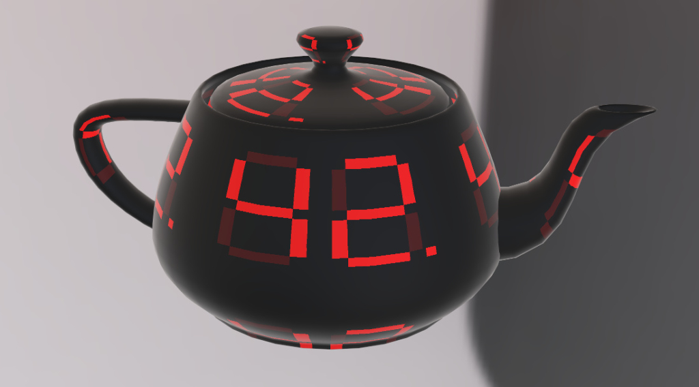

# Verge3D 3.3.1 发布

> 发布时间：2020年8月3日

本次更新主要修复了Verge3D 3.3 for Blender, 3ds Max和Maya中出现的几个错误。在3ds Max版中引入了新的OSL节点，并且通过优化进一步提升了应用的加载速度。

## OSL 节点

OSL着色器列表中添加了新的OSL节点。

此次新增节点包括：**Mandelbrot(曼德勃罗集)**, **Digits(数字)** (如上图所示), **Rivets(铆钉)** (如下图所示), **Radians-to-Degrees(弧度转角度)**, **UVW Row Offset(UVW行偏移)**, **Toon Width(卡通宽度)**, **Wave Length(波长)**, **Half Tone Dots(半色调点)**, **Weave(半色调点)**, **Candy(糖果)**, **UVW Environment(UVW环境)**, **Threads(线程)**, and **Atan(反正切)**。

## 故障修复

尽管大多数用户都对加载速度显著提升给予好评，但当场景中存在许多着色器时，会出现加载速度变慢的情况。目前，此问题已得到解决。

此外，此次更新还修复了以下错误：

- 修复了论坛中上报的**get object transform/rotation(获取对象变换/旋转)**拼图产生的返回弧度而非度数的[错误](https://www.soft8soft.com/topic/get-rotation-and-set-rotation-in-3-3-0/)。
- 修复了论坛中上报的使用剪切平面时的[崩溃问题](https://www.soft8soft.com/topic/object-clipping-issues/)。
- 修复了与材质相关的多种拼图潜在问题。
- 修复了从Blender错误导出的几何问题。
- 修复了3ds Max的OSL节点的纹理环绕模式。
- 修复了Maya导出器因驱动关键帧动画以及因缺少阴影组而导致的崩溃问题。

## 立即升级

一如既往，在[Verge3D最新发行版下载](https://mp.weixin.qq.com/s/K-AWZ8smyOUt1pm0lgmpzQ)一文中获取最新预览版的百度盘分享链接吧！欢迎通过[论坛](https://www.soft8soft.com/forums/)、微信公众号、[QQ群](https://shang.qq.com/wpa/qunwpa?idkey=c31cf6597f3ed7ce68bd47aba6bba23049bf973ac6acc59b0a5a7d1bd933b3ea)、[电子邮件](mailto:verge3d@funjoy.tech)提出建议与意见！

