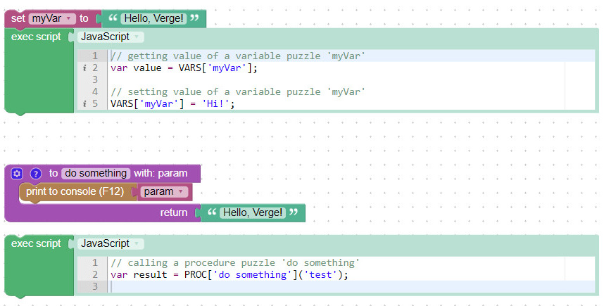

# Verge3D 3.4 for Maya 发布

>  发布时间：2020年9月28日

作为面向艺术家与设计师的WebGL开发套件，Verge3D一直在可用性和易用性角度做出改进与升级。  
Verge3D 3.4 版可通过使用页面滚动、多行文本和脚本拼图，来创建有趣的3D场景转换，改进了对OSL着色器的支持，增加了低延迟音频，实现了无需编码即可引入雾和射线投射。另外，此版本支持AR模式，并新增了许多其他特性和性能改进，请从下文中了解。


## 滚动过渡效果
现在，您现在可以跟踪用户的滚动量，从而可以根据滚动条的位置在3D场景中实现各种变换。这种非常有趣的效果可用于创建精美的网站、登录页面或产品演示。  
参见此[官方案例](https://cdn.soft8soft.com/demo/applications/scroll_animation/scroll_animation.html)，其中滚动量会影响动画、相机位置和颜色变化。

这依赖于event(项目)拼图的新选项——**scrol****l(滚动)**，且**get event property(获取项目属性)**拼图新增**scrollX(水平滚动)**和**scrollY(垂直滚动)**属性。  


有关详细说明，请参见以下教程：  
https://player.bilibili.com/player.html?bvid=BV1YK4y1h7e5

<p><iframe src="https://player.bilibili.com/player.html?aid=884908707&amp;bvid=BV1YK4y1h7e5&amp;cid=243937708&amp;page=1" width="500" height="800" frameborder="no" scrolling="no" allowfullscreen="allowfullscreen"> </iframe></p>


上面链接的演示案例“Scroll Animation”包含在3.4版随附的Verge3D示例中。


## 多行拼图和脚本执行

现在，“**Text**(文本)”类别中提供用于输入多行文本的拼图，它可与任何接受文本作为输入对象的拼图一起使用。


使用该拼图，您可以在应用中插入大量文本，无论是产品描述，亦或是某些自定义HTML / CSS标记。

底层的多行拼图基于可嵌入的[Ace](https://ace.c9.io/)编辑器，特别用于Amazon的Cloud9代码编辑器。它提供的功能包括语法突出显示、行编号、自动缩进，代码折叠和实时语法检查器。

另外，还新增执行JavaScript的拼图，位于“**Advanced(****高级**)”类别中。结合上述多行拼图，它使您可以直接在拼图编辑器中使用代码，而无需手动编辑任何脚本


在此拼图中键入的JavaScript代码可以与其余场景交互。 因此，您可以访问变量拼图，也可以从其内部触发程序拼图。  



在JavaScript和拼图之间实现互操作性的原始并更倾向于代码的方法继续有效。有关更多信息和用法详情，请参阅[该文档](https://www.soft8soft.com/docs/manual/en/introduction/Using-JavaScript.html)。


## 骨骼动画

Maya中的对象有个称为“**Skeletal Root(骨骼****代码)**”的复选框。如果为对象或骨骼启用了该功能，则所有子骨骼都将被视为单个动画骨骼。从而，您只能为该根对象或骨骼播放动画，而无需触发所有骨骼的动画。  


为了使用此功能，我们还对“增强现实”演示进行了调整。


## OSL 着色器

现在，您可以使用开放着色语言(OSL)创建自定义实时着色器。可以通过**aiOslShader**节点将OSL代码赋予着色器。


着色器本身可以使用OSL代码编写，也可以从某些[着色器库](https://github.com/ADN-DevTech/3dsMax-OSL-Shaders)中借用。

如果您对手动转换和调试OSL着色器感兴趣，则可以使用脚本`osl2glsl.py`运行转换器。 该转换器已根据MIT许可开源，可在[Github](https://github.com/Soft8Soft/pyosl)上获得。


## 其他Maya专属功能

在此版本中，我们支持多材质对象的蒙皮。

导出稳定性也有所提高。

修复了导出两次阴影组的问题，还修复了与蒙皮相关的导出崩溃问题。


## 新的音频后端

**load sound(**加载声音)拼图新增切换**sound(声音)**和**music(音乐)**。其中，切换到声音表示启用Web Audio后端，切换到音乐表示启用HTML5音频后端。


Web Audio后端可播放低延迟和无间隙循环的音频。我们已经优化了发型包中所有案例的音频部分。

我们仍然建议仅将Web Audio用于短音带，因为它需要更多的内存和更高的处理能力。对于较长的音频条，例如背景音乐，最好使用HTML5音频。

此外，**feature availab****le(****可用功能)**拼图新增**Web Audio API**选项，您可以在此检查浏览器是否支持此Web标准。 您也可以使用JavaScript API的方式`Detector.checkWebAudio()` 进行检查。


拼图编辑器的“**Sound/Video(**声音/视频)”类别已重命名为“**Audio/Video(**音频/视频)”。

现在可以在拼图编辑器的“**Init(**初始化)”选项卡中使用声音拼图，从而预先加载声音。


## 雾和射线投射

新增**add fog(****添加雾****)**拼图，无需编码即可添加雾效。


您也可以指定雾的颜色和密度，将RGB或密度设置为零从而将其删除。


新增**ray cast(****射线投射)**拼图，您可以在[参考页面](https://www.soft8soft.com/docs/manual/en/puzzles/Scenes.html#raycast)找到相关描述和使用示例。


## AR 改进

目前，**enter AR mode****(进入AR模式)**拼图支持类似于VR对应对象的各种定位模式：**loo****king around(****环顾)，****sitting or standing(****坐/立)，****room(****室内)****，walking(步行)和****viewer locked(****观察者锁定)**。


而为了与旧场景兼容，AR的最佳模式是**sitti****ng(坐)**或**standing(立)**，**room(室内)**或**walking****(步行)，**其中默认模式设置是**looking around(****环顾)**（即当用户从场景原点观看）。


## 连接器

Connectors(连接器)拼图是一个新的便捷拼图，可用于组合具有返回值（例如声音）的拼图。


您无需再创建辅助变量，也能将这些拼图组合在一起。


## 安装程序

我们在Windows版安装程序中已使用扩展验证证书进行签名，因此不再显示“未知发布者”的警告。


## 其他改进

**replace texture****(替换纹理)**拼图现在支持将视频纹理分配给与gltf兼容的材质。**replace texture****(替换纹理)**和**get texture param****(****获取纹理参数)**拼图也可以正确地与视频纹理配合使用。

通过在WebGL纹理中使用RGB格式而非RGBA，减少了JPEG纹理的内存消耗。此外，**export to gltf(****导出到gltf****)**拼图现在可以直接导出JPEG纹理，而无需将其预转为PNG。

现在可以通过将JavaScript API属性设置 `OrbitControls.screenSpacePanning` 为**false**来启用水平相机平移（用于实现类似Google Maps的悬停控制），例如：

```
app.controls.screenSpacePanning = false;
```

**set style(**设置样式)和**set attribute(**设置属性)拼图现在可以在IE 11中使用。**set style(**设置样式)拼图的插槽**@media**现在也可以在macOS和iOS的Safari浏览器中使用。

我们在**用户手册**中添加了[新的章节](https://www.soft8soft.com/docs/manual/en/introduction/Hardware-Related-Issues.html)，其中概述了创建场景时可能遇到的一些硬件限制。增加了对有关“Too many attributes”的错误的说明。


## 稳定性提升
- “活动摄像机”拼图现在可以正确启用/禁用渲染拼图（感谢用户报告[问题](https://www.soft8soft.com/topic/problem-when-switching-active-camera-with-antialias/)）。
- 现在可以在VR模式下正确切换基于图像的照明（感谢用户报告[问题](https://www.soft8soft.com/topic/vr-version-of-my-vehicle-fantasy-timer-and-ibl-lighting-issues/)）。
- 修复了**export to gltf(****导出至gltf)**拼图时导致UV丢失的问题。
- 修复了未完成回调时相机补间的错误（感谢用户报告[问题](https://www.soft8soft.com/topic/bug-orbitcontrol-tween-not-calling-finishcb-if-the-camera-is-already-there/)）。
- 修复了形状键和分配材质的错误（感谢用户报告[问题](https://www.soft8soft.com/topic/assign-material-conflicts-with-morph-factor/)）。
- 在**event(项目)**拼图中删除了重复的point事件选项。
- JavaScript方法`Material.toJSON()`不再因基于节点的材质而出错。


## Verge3D 旗舰版
此次更新最终完成了Verge3D 3.4 for Blender，3ds Max和Maya的新版本发布。因此，我们更新了[Verge3D旗舰版](https://verge3d.funjoy.tech/shop/product/ultimate-verge3d-24#attr=)，以同步这些版本的所有更新。


## 立即升级
一如既往，在[Verge3D最新发行版下载](https://mp.weixin.qq.com/s/K-AWZ8smyOUt1pm0lgmpzQ)一文中获取最新预览版的百度盘分享链接吧！欢迎通过[论坛](https://www.soft8soft.com/forums/)、微信公众号、[QQ群](https://shang.qq.com/wpa/qunwpa?idkey=c31cf6597f3ed7ce68bd47aba6bba23049bf973ac6acc59b0a5a7d1bd933b3ea)、[电子邮件](mailto:verge3d@funjoy.tech)提出建议与意见！

