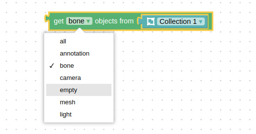

# Verge3D 3.5 for Blender发行日志

> 发布时间：2020-11-24

期待已久的Verge 3.5版来了！这是一个添加了无数新功能的大版本更新，其中最重要的包括Verge3D插件系统、柔体模拟、物理约束、镜面反射工作流、融球、高级鼠标控制，以及许多用户要求的新拼图等。我们还在此次发行版中随附了一个新的游戏案例。

## 街机赛车

Arcade Racing案例充分展示了Verge3D物理引擎的特性，这是一个复古风的游戏，具备完整的世界交互与高级车辆物理特性，适配了移动端的控制与音效。[点击这里体验！](https://cdn.soft8soft.com/demo/applications/arcade_racing/arcade_racing.html)


查看下文，了解关于物理引擎的诸多特性详细介绍。

## Verge3D插件

您现在可以为Verge3D添加新的功能，并将其转换为拼图以方便调用。


添加您自己的拼图是最直接的方式。首先，您需要在 **puzzles/plugins** 目录下创建一个新的文件夹，并在其中放置一个名为 `init.plug` 的XML文件。这样，您的拼图编辑器的工具箱里就有了一个新的拼图类目。

```xml
<category name="My Puzzles" colour="green">
    <block type="printHelloWorld"></block>
</category> 
```

在同一目录下，您可以为每一个拼图创建一个JavaScript文件以实现其功能，比如，`printHelloWorld.block`由此，拼图编辑器中将自动拾取这些文件，并插入到工具栏中对应的新类目中。

为帮助您了解并熟悉创建Verge3D插件的方式，我们将“E-commerce” 类目下的四个拼图重置为插件文件（此插件为安装程序中的可选项）。请在此目录 **puzzles/plugins/E-commerce** 下查看。

请查阅 [用户手册](https://www.soft8soft.com/docs/manual/zh/puzzles/Plugins.html) 中有关创建Verge3D插件的详细介绍。

## 柔体物理特性

在之前实现的 *刚体模拟* 的基础上，我们又新实现了 _柔体模拟_ 。

为开始使用柔体物理特性，您必须启用 **create physics world(创建物理世界)** 拼图中对应的选项。这样，您就可以通过 **create soft body(创建柔体)** 拼图来改变对应的物体为柔体了。


目前可创建3种类型的柔体——**ropes**（绳子，任何可延长的，弹性物体）, **patches**（曲面，比如服饰），以及 **volumes**（体积，任何可压缩的物体）。此外，柔体也可以使用 **anchor soft body(锚定柔体)** 拼图固定在刚体上，可以实现诸如挂在绳子上的球体这样的案例。


您可以在Verge3D最近更新的官方案 [Physics](https://cdn.soft8soft.com/AROAJSY2GOEHMOFUVPIOE:27395daced/applications/physics/physics.html) 中看到柔体模拟的效果。

## 物理约束

物理引擎中另一个可用的重要特性是 *约束(constraints)* 。通过使用约束，您可以限制刚体的移动来创造出许多有趣的案例，例如铰链、弹簧、钟摆等。我们也实现了一个用于取消约束的拼图。


在 **create rigid body（创建刚体）** 拼图中增加了空对象碰撞形状（以前称为 **create physics body**，创建物理体）。可以通过它来实现用不可见对象实现约束。例如，先创建一个不可见点，再使用铰链约束将刚体附着到此点。再比如，用不可见的点来固定柔体。


由上述拼图创建的约束也可以通过JavaScript进行访问，例如：

```js
v3d.puzzles.physics.constraints\['Suzanne'\]\['Axis'\];
```

为防止混淆，之前版本中 **Physics \| 物理** 类目下的非物理性拼图，已经移到了 **Animation \| 动画** 类目下。

您可以体验 [Physics demo（物理引擎案例）](https://cdn.soft8soft.com/AROAJSY2GOEHMOFUVPIOE:27395daced/applications/physics/physics.html) 来实际体验其中的一些约束。

## Blender集成

节点 **Shader>Specular（着色器>镜面）** 现已支持。它类似于原理性BSDF节点，但使用 _镜面_ 工作流程而不是 _金属度_ 工作流程。镜面工作流程通过指定面 (沿法线) 反射颜色来运行。请参阅 [Blender手册](https://docs.blender.org/manual/zh/latest/render/shader_nodes/shader/specular_bsdf.html) 中有关此节点的更多详细信息。


[Meta balls（融球）](https://docs.blender.org/manual/zh/latest/modeling/metas/introduction.html) 现在可以直接导出，无需预先转换曲面，如下图所示。


如果有兴趣，您可打开并查看这个泰迪熊的原始 [.blend文件](https://www.soft8soft.com/wp-content/uploads/2020/10/metaball_bear.blend)  。

节点 **Black Body（黑体）** 现已在Verge3D中支持。


正交摄影机的Verge3D设置增加了 **Min Zoom（最小缩放）** 和 **Max Zoom（最大缩放）**。这些设置对应了透视摄影机中的距离限制。


glTF兼容材质中的 [Base color factor（基础色因子）](https://github.com/KhronosGroup/glTF/tree/master/specification/2.0#pbrmetallicroughnessbasecolorfactor) 现已得到支持，参见下图中的指定：


提升了纹理插值的**最接近**模式的品质(可用于**图像纹理**节点) 。


增加了在任何情况下都禁用抗锯齿的选项。


空节点现在可以正常工作了（感谢用户[报告](https://www.soft8soft.com/topic/coloring-not-showing-in-verge3d/)）。


修复了3.4版中 **Clear Coat（清漆）** 输入节点损坏的错误（感谢用户 [报告](https://www.soft8soft.com/topic/pricipled-bsdf-clear-coat-missing-in-3-4/) 此问题）。此外，实例对象正确的集合和可见性也可以正确传递了。

## 鼠标控制

双击、左/中/右键点击检车以及添加到 **when clicked（当点击时）** 拼图中。


此外，在拼图 **when clicked（当点击时）** 和 **when hovered（当悬停时）** 的选项中添加了 x-ray 选项。如果启用，这些拼图将可以与其他对象重叠的对象交互。


当被点击或悬停的对象位于半透明表面的后面，或在被渲染为贴花或不按通常的渲染顺序的对象后面时，这个功能可能会派上用场。

## 拼图的可用性改进

为选择器拼图添加了一些有趣的图标——对象、材质、组、动画、声音和视频——这样就更容易一眼看明白对象的类别了。


为大部分拼图添加了默认的“影子”输入节点，以减少您打开工具箱拖拽拼图的频率。但您依然可以用任何适合的拼图来替换这些“影子”。


在Advanced(高级)类目中，新增了一个用来作为代码注释的拼图块 Commentaries(注释) 。


除了让您的拼图场景更加清楚，这些拼图块将被转换为实际的JavaScript代码代码以方便调试时阅读。此外，Advanced(高级)类目的颜色更改为蓝色。

减小了 **multi-line(多行)**  拼图的最大高度，以适应大多数屏幕的分辨率。

## 新拼图

新增了拼图块：**in list check occurrence of item(在列表中检查项目的出现情况)** 。通过此拼图您可以轻松找到列表中是否包含某项目。


另一个新拼图块是：**get animation frame(获取动画帧)** 。您可以使用它来从动画中获取当前播放的帧。例如，当您想将动画从某一帧暂停，然后再反向播放时，这个拼图将会非常有用。


新增了控制灯光的拼图：**get light param(获取灯光参数)** 和 **set light param(设置灯光参数)**。您可以用它们来取回及改变灯光的颜色和强度。


新增了一个用于加快或降低音、视频片段回放速度的拼图。此外，这个拼图还可以用来模拟赛车游戏中的汽车引擎加速。


Advanced(高级)类目中新增了 JavaScript object(JavaScript对象) 的拼图：顶层的 _[窗口](https://developer.mozilla.org/en-US/docs/Web/API/Window)_ 对象，内置的 _[arguments](https://developer.mozilla.org/en-US/docs/Web/JavaScript/Reference/Functions/arguments)_ 数组和 _[this](https://developer.mozilla.org/en-US/docs/Web/JavaScript/Reference/Operators/this)_  关键字。


参见 [参考页面](https://www.soft8soft.com/docs/manual/zh/puzzles/Advanced.html#javascript_object) 了解用法和示例。

## HTML拼图

新增 **create CSS rule(创建CSS规则)** 拼图。特别是，你可以用这个拼图创建新的类，把它们应用于HTML元素。


拼图 **add HTML element**(**添加HTML元素)** 不再自动设置 **position(位置)** 为 **absolute(绝对值)** 。如果您依赖此功能，请仔细检查应用。我们还为这个拼图的输入添加了一个默认的 **文本**（见上方截图）。

拼图对 **set/get attr(设置/获取属性)** 被重新命名为 **set/get prop(设置/获取属性)** ，以匹配相应的JavaScript方法（请参见上方截图）。

HTML拼图 **get event property(获取事件属性)** 在下拉列表中新增选项：**touches.length**, **touches\[0].pageX**, **touches\[0].pageY**, **touches\[1].pageX**, 和 **touches\[1].pageY** 。您可以使用这些选项来实现多点触摸控制，如同在本次更新中新增的案例赛车游戏中所示。


此拼图也增加了 **code(代码)** 属性，它是实现键盘控件的现代方法。


您可以访问 [keycode.info](http://keycode.info/) 网站，按键查看对应代码。


为 **event** 拼图增加了 **focus** 和 **blur** 事件。


## 其他拼图改进

为 **set object direction(设置对象方向)** 拼图添加了 **point(点)** 复选框。默认情况下，它是被启用的，以重现旧有的行为。如果禁用此复选框，则该拼图将改为使用方向向量。


拼图 **clone object(克隆对象)** 现在可以与 **Text(文本)** 拼图连接了。

现在 **performance info(性能信息)** 拼图中会打印视窗分辨率。这使你能够估计正在处理的实际像素量。


在 **get all objects(获取所有对象)** 拼图中支持选择骨骼和空对象了。



在 **Init \| 初始化** 选项卡中，可以使用 **get date time(获取日期时间)**, **open web page(打开网页)**, **social share link(社交分享链接)**, **gamepad index(手戏手柄索引)**, **get gamepad prop(获取游戏手柄属性)** 拼图了。

## JavaScript方法和集成

为App类增加了 **onBeforeRender** 和 **onAfterRender** 事件。因此，您可以注册事件侦听器来检测这些事件，并在每个帧中执行各种操作。


`OrbitControls.inTween` 属性现在可以检测或禁用过程性摄影机动画。


此外，如果摄影机的向上向量不是严格向上的，轨道控制现在也可以正常工作。

如果与HTML覆盖相关的鼠标控件出现任何问题，现在可以调用了

```js
app.controls.forceMouseUp();
```

我们显著地简化了在 _React.js_ 和 _Vue.js_ 中使用Verge3D的流程，尤其是拼图。还有，`V3DApp.createApp()` 方法现在返回一个JavaScript _Promise。_在React中，Verge3D应用现在作为一个单独的组件实现。有关上述更改的更多详细信息，请参阅 [文档](https://www.soft8soft.com/docs/manual/zh/programmers_guide/Integration-with-Reactjs-Vuejs.html) 。

gltf导出器功能包含在引擎核心和公开的API类 `v3d.GLTFExporter` 中以便更好地与引擎内部集成。因此，在相应的拼图中，可见性(visibility)的问题得到了修复（感谢[反馈](https://www.soft8soft.com/topic/download-gltf-puzzle-not-working-with-visibility/)）。

## 更多物理系统功能

我们引入了一个新的物理系统拼图：**apply body param(应用实体参数)** 。它取代了旧的 **physics body params(物理实体参数)** 和 **apply vector(应用向量)** 拼图。


新的拼图可以使用数字或向量。与旧的拼图不同，您可以设置需要更改的单个参数，而不必设置所有参数。

我们还增加了另一个有用的拼图——**get body param**(**获取实体参数**)——用于从与指定对象相关的实体中获取一个参数。此功能可能的用途之一是角色跳跃。

另一个重要的特性是可以从JavaScript代码访问使用拼图初始化的物理系统世界和实体，例如：

```js
v3d.puzzles.physics.world;
v3d.puzzles.physics.bodies;
```

这允许您通过JavaScript代码（如车辆物理系统等）将更多的高级物理系统应用到您的场景中。在下面的简单示例中，您可以将脉冲应用于立方体：


接下来，引入了新的JavaScript API，用于将自定义物理系统模拟与图形同步：

```js
// add obj / body to the sync list
// the type can be 'DYNAMIC', 'KINEMATIC', 'STATIC', 'GHOST', or 'SOFT\_BODY'
v3d.puzzles.physics.addToSyncList(obj, body, 'DYNAMIC');
 
// remove obj / body from the sync list
v3d.puzzles.physics.removeFromSyncList(obj, body);
```

例如，这些方法可用于实现车辆物理系统。请在 [本页](https://www.soft8soft.com/docs/manual/zh/puzzles/Physics.html#extending_with_javascript) 查看更多详细信息。

最后，我们更新了Verge3D的物理系统运行时**AMMO.JS**，包括上游存储库中的最新改进。物理系统引擎可用的内存数量增加到128 Mb，以允许更复杂的物理模拟。

## 其他改进

现在可以为标注指定自定义CSS类。在之前，添加的类会立即被Verge3D重写。


我们对以下示例进行了更新和改进：“Elearning”, “Load Unload”, “Augmented Reality”.

更新及进一步扩展了以下用户手册页：[功能特性](https://www.soft8soft.com/docs/manual/zh/introduction/Features.html)，[glTF材质](https://www.soft8soft.com/docs/manual/zh/blender/GLTF-Materials.html)和各种拼图参考页面。还有，应用管理器 [设置](https://www.soft8soft.com/docs/manual/zh/introduction/App-Manager.html#App_Manager_Settings) 和 [模板](https://www.soft8soft.com/docs/manual/zh/introduction/App-Manager.html#Templates) 功能被完整地记录在案。

## 错误修复

修复了 **append scene(附加场景)** 拼图在某些情况下崩溃的问题。

修复了一个阻止构建Verge3D旗舰版安装程序的问题。

修复了拼图编辑器中由多个包含VARS变量代码的 **exec script(执行脚本)** 拼图。

修复了 **detect collision(检测碰撞)** 拼图对群组对象不起作用的问题。

拼图 **set object direction(设置对象方向)** 现在可以与多个对象一起工作（感谢[反馈](https://www.soft8soft.com/topic/improper-display-of-ar-objects-containing-group-dependencies/)）。

修复了物理系统拼图 **create rigid body(创造刚体)** 不适用于运动网格的bug（感谢[反馈](https://www.soft8soft.com/topic/new-physics-also-changed-the-behavior/)）。

拼图 **set factor(设置因子)** ， **set material value(设定材质值)** 和 **set morph factor(设定变形因子)** 现在在输入文本值时可用了，如基于HTML的滑块（感谢[反馈](https://www.soft8soft.com/topic/controlling-3d-model-dimensions-with-sliders/)）。

## 获取Verge3D 3.5

欢迎 [下载](https://www.soft8soft.com/get-verge3d/) 新版本并 [更新](https://www.soft8soft.com/docs/manual/zh/introduction/App-Manager.html#Update) 您的应用程序！我们很乐意在 [论坛](https://www.soft8soft.com/forums/) 回答您的问题。