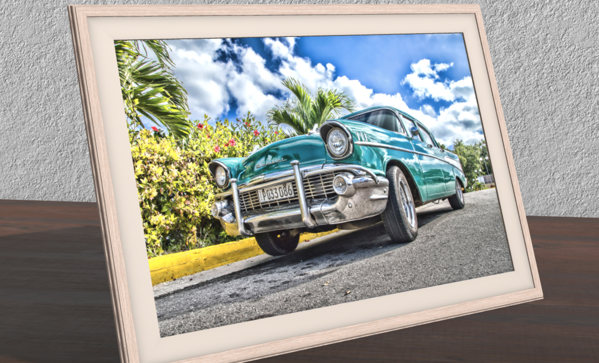

# Verge3D 3.6.1版发布

> 发布时间：2021年2月19日

此版本为维护更新版：修复了Verge3D3.6版本中的发现的几个小bug；额外添加了一个新的拼图，用以处理拖放到应用窗口中的文件；并在工具中实现了一些可用性改进和优化。

## 拖放文件！

新增拼图 **drop file to****（拖放文件到）**，允许用户从电脑目录中拖拽文件到浏览器标签中供应用直接调用。

例如，您可以拖拽一个图像文件到场景以用作纹理，或拖拽.csv数据文件，甚至可以拖拽.glb文件用作场景来显示。详细说明请参阅[文档](https://www.soft8soft.com/docs/manual/en/puzzles/HTML.html#drop_file_to)。

案例[Custom Image（自定义图像）](https://cdn.soft8soft.com/demo/applications/custom_image/custom_image.html)已经更新并部署了此功能，您可以试试拖放任意图片到相框中看看效果。

## 性能改进

此版本对应用管理器的可用性进行了改进并修复了错误，主要内容包括：

- 使用LZMA压缩的文件限制从256 Mb提高到1024 Mb，以允许您压缩非常大的场景（例如从CADs或BIMs导入的场景）。
- 当设置[**Enable external server interface(启用局域网服务器)**](https://www.soft8soft.com/docs/manual/en/introduction/App-Manager.html#App_Manager_Settings)时，应用管理器将不再有冻结问题。

- 指定**External application directory****(****外部应用目录****)**将立即生效，无需再重启应用管理器了。

此外，现在拼图编辑器的加载速度更快了。

## 问题修复

修复了与近期发布的安卓Chrome 88版本相关的AR/VR关键问题，这一更新处理WebXR的方式略有不同。

如果OpenType.js库没有复制到应用目录中，将不再导致应用管理器奔溃，但控制台中会打印错误日志，所有文字设置都将无效。

预加载器的JavaScript回调现在从0%开始调用，此前这一数值将被掠过。

改进了macOS下Chrome浏览器中环境的渲染治疗。

现在Blender中**Principled BS****DF(****原理化BSDF)**的Sheen可以设置大于1的数值了，感谢用户的[反馈](https://www.soft8soft.com/topic/sheen-not-working-in-3-6/)。

3ds Max中的4通道控制器可以使用了，感谢用户的[反馈](https://www.soft8soft.com/topic/colormap-stopped-to-work/)。

## “毅力号”着陆火星

另一个振奋人心的消息是，[毅力号火星探测器](https://mars.nasa.gov/mars2020/)已经成功着陆，并发回了它的第一张照片！您可以查看NASA使用Verge3D制作的[交互程序](https://mp.weixin.qq.com/s/LY0HuoZrSz4v-KovcBFixg)来了解关于此次任务的更多信息。

## 下载更新

如果您在项目中遇到了如上问题，或者希望使用以上更新的功能，请升级您的Web3D应用到3.6.1版。一如既往，在[Verge3D最新发行版下载](https://mp.weixin.qq.com/s/K-AWZ8smyOUt1pm0lgmpzQ)一文中获取最新预览版的百度盘分享链接吧！欢迎通过[论坛](https://www.soft8soft.com/forums/)、微信公众号、[QQ群](https://shang.qq.com/wpa/qunwpa?idkey=c31cf6597f3ed7ce68bd47aba6bba23049bf973ac6acc59b0a5a7d1bd933b3ea)、[电子邮件](mailto:verge3d@funjoy.tech)提出建议与意见！

