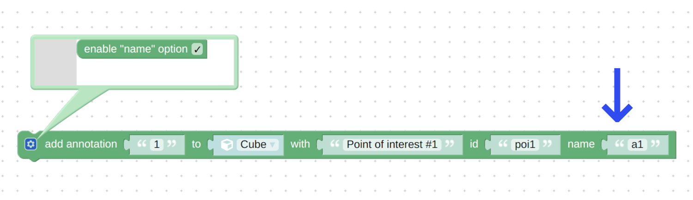

# Verge3D 3.8 pre1预览版发布
 
Verge3D 3.8 pre1预览版发布了，以下是新增的功能以及修订的错误。请阅读参考。

## 光照探头(Blender、3ds Max及Maya)

为 _光照探头_ 功能增加了新选项-_自定义影响_ 。

通过此功能，您可以分辨出光照探头会影响到哪些对象，从而提升场景渲染的真实度（尤其是场景中使用了多个重叠的光探头时）。

透明度模式 **Alpha Hashed/Coverage(覆盖)（Blender、3ds Max、Maya）**

支持了在Blender中称为 _Alpha Hashed_ ，在3ds Max和Maya中成为 _Coverage(覆盖范围)_ 的透明度。该特性可以去除三角形排序伪影，从而在场景渲染中实现与顺序无关的透明。这种类型的透明度只有在 _MSAA_ 已启用的情况下才可使用（MSAA是在抗锯齿选项设置为默认 _Auto(自动)_ 时的选项）。

## Maya专属特性

为用于添加 _光照探头_ 的 _立方体(盒)反射贴图_ 添加了 _可见性选择集(Visibility Selection Set)_ 功能（之前版本中只在Blender和3ds Max可用）。它表示仅在立方体贴图中渲染的对象。此外，还为立方体(盒)反射的所有设置添加了弹出提示。

支持了摄影机属性中的 _适合分辨率门(Fit Resolution Gate)_ 设置的所有4个选项。您现在可以选择跟随垂直或者水平维度视场角度了，并将其沿用到Verge3D应用中。

Verge3D支持了新的Maya节点：_aiCheckerboard_, _aiImage_, _aiColorToFloat_ 和 _aiTwoSided_ 。

## 拼图

拼图 _set transform(设置变换)_, _set object direction(设置对象方向_)，以及 _change local transform_(_改变局部变换)_ 现在可以接受 _向量或列表(Vector or List)_ 的输入了。

拼图 _set morph target(设定变形目标)_ 和 _get morph target(获取变形目标)_ 现在可以使用 _Text(文本)_ 输入了，之前进支持在下拉菜单中选择变形目标。这将有助于通过使用变量在应用中实现更加程序化的变形方法。

现在在 _add annotation(添加标注)_ 拼图中可以启用 _name(名称）_ 属性字段了，从而使标注名称与其标签不同（这在场景中有多个带有相同标签的标注时很有用）。

## 其他改进

在我们中国社区的帮助下，_用户手册_ 已全文翻译为[中文](https://www.soft8soft.com/docs/manual/zh/index.html)。

修复了 _SSAO_ 效果严重的性能问题——它现在工作快多了！