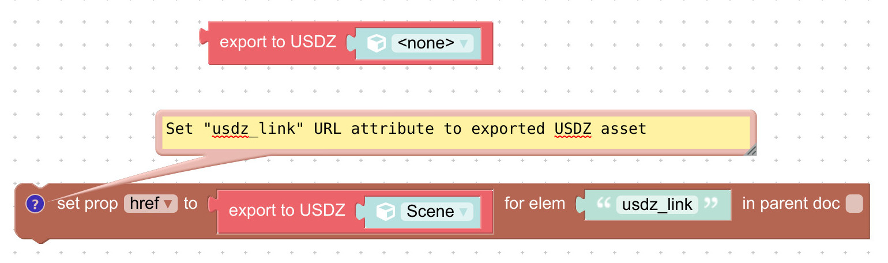
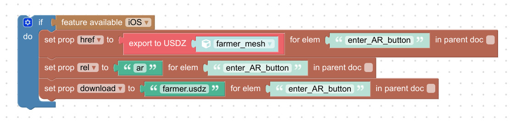
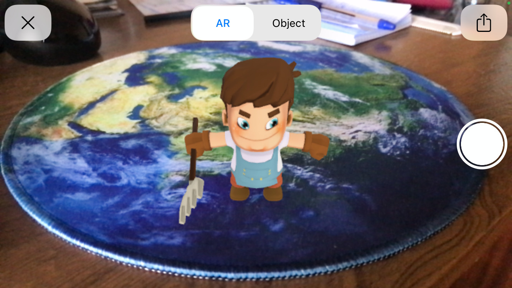
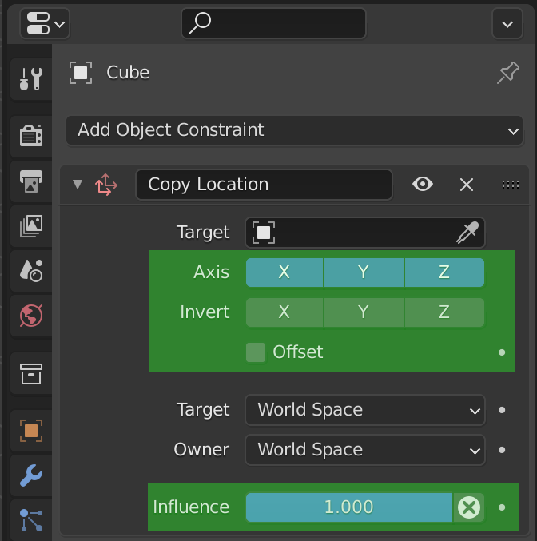
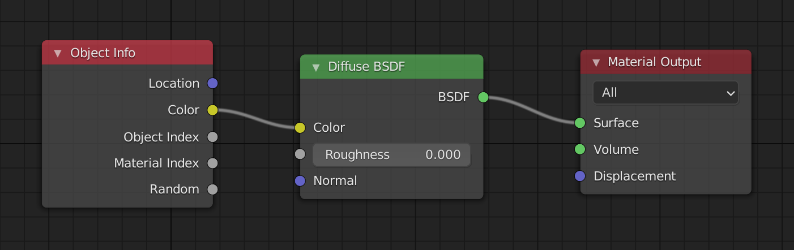
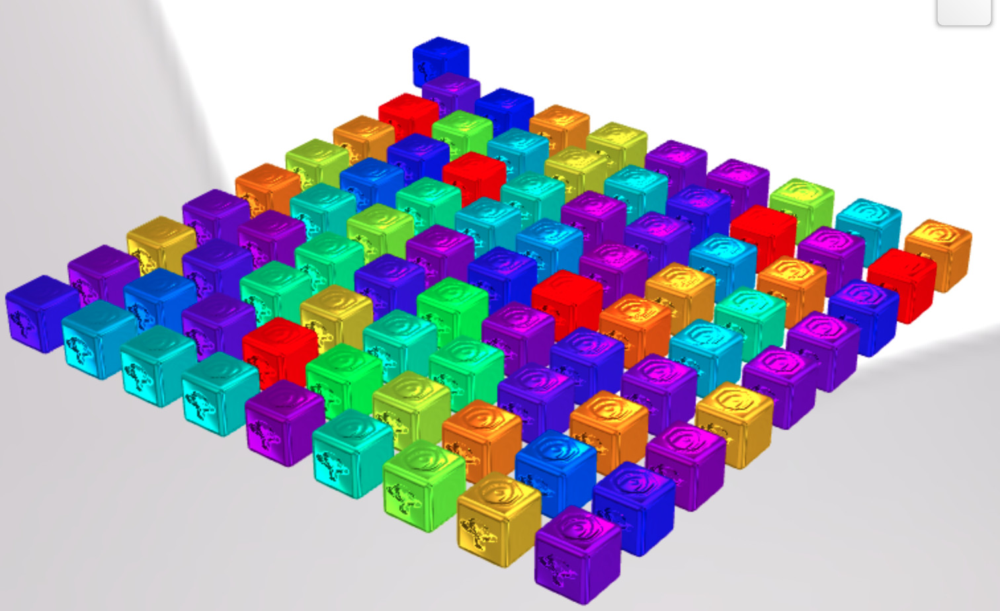
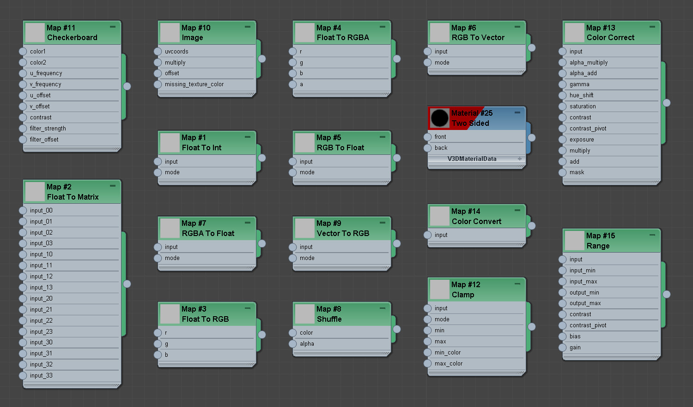
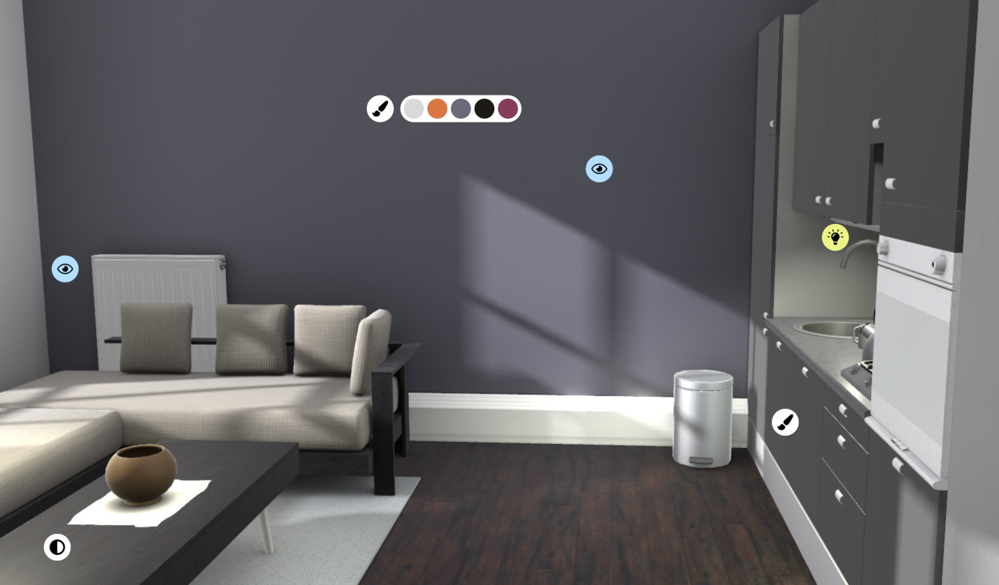
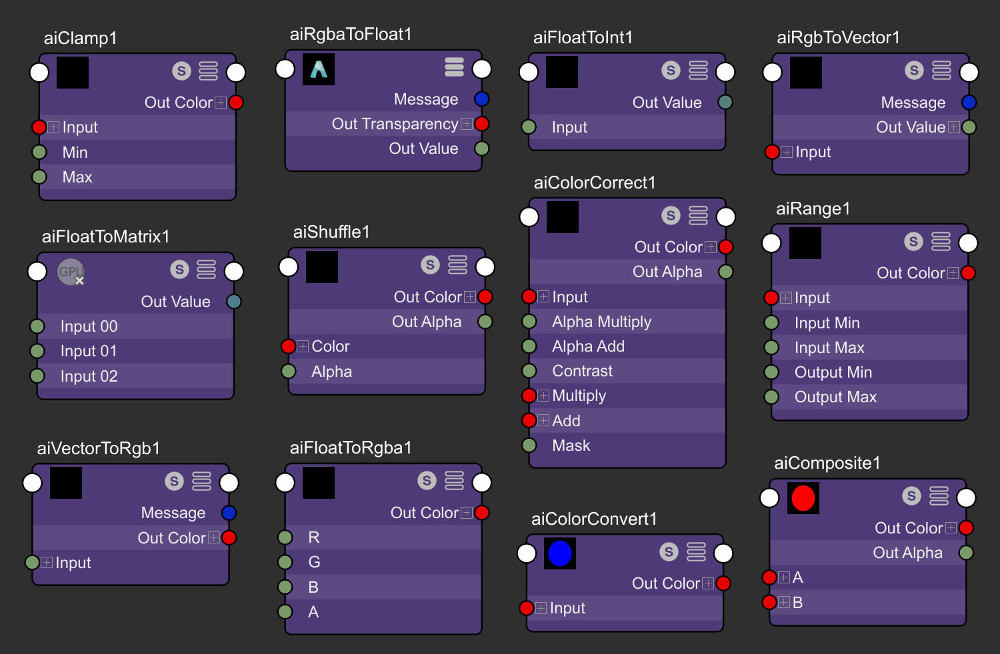

# Verge3D 3.8 pre2预览版发布

## 通过USDZ格式在iOS原生浏览器中启用增强现实

目前，浏览器中的 _WebXR_ 技术标准仅 _适用于Android系统的Chrome浏览器_ ，_苹果公司_ 还在努力为移动端的 _Safari浏览器_ 做适配。但 _苹果_ 有一套自己的方法，即使用Pixar通用场景描述格式(USD)实现网页中的增强现实，但这一方案相比起WebXR缺乏交互特性。

在本次更新中，我们设法在运行时中部署了一个导出器，可用 _拼图_ 中压缩输出 _.USDZ_ 格式。

因此，现在通过这种方法为iOS创建AR内容简单多了：首先导出到USDZ，然后替换“Enter AR”按钮的链接即可。

为了达到最佳效果，我们建议使用与GLTF兼容的材质。我们已经更新了官方案例 _Augmented Reality_ ，现在其可在iOS上直接运行网页增强现实了。请使用iPhone或iPad上查看：[链接](https://cdn.soft8soft.com/demo/applications/augmented_reality/augmented_reality.html).

## Blender专属特性

现在 _复制位置_ 约束支持更多的设置了：_轴向_ ， _反转_ ， _偏移量_ ，以及 _影响_ 。感谢用户[建议](https://www.soft8soft.com/topic/copy-location-rotation-but-with-offset/)，抱歉迟迟没有回应。

现在Verge3D支持节点 _对象信息（物体信息，Object Info）_ 了。通过它，您可以使用一个材质来绘制多个对象——例如，使用对象的顶点颜色来绘制它们。

## 3ds Max专属特性

在本次更新中，我们支持了一系列新节点：_Checkerboard, Image, Two Sided, Float To Int, Float To Matrix, Float To RGBA, RGB To Vector, RGBA To Float, Vector To RGB, Shuffle, Clamp, Color Convert, Color Correct, Range, Float To RGB, 和 RGB To Float_.

Verge3D 3.7版中引入的 _光照探头_ 功能案例 _全局照明_ 已经打包在发行版中。在此处查看实时：[链接](https://cdn.soft8soft.com/demo/applications/global_illumination_max/global_illumination.html).修复了导入包含 _立方盒反射贴图_ 对象的文件时的问题。

## Maya专属特性

对于本更新，我们支持一系列新节点：_aiFloatToInt、aiFloatToMatrix、aiFloatToRgba、AIGBtoVector、AIGBatoFloat、aiVectorToRgb、AIICLAMP、aiColorConvert、aiComposite、aiRange、aiColorCorrect 和 aiShuffle_.

修复了导入包含 _立方盒反射贴图_ 对象的文件时的问题（用于_光照探头_ ）。修复了使用命名空间时发生的导出崩溃问题。

## 其他改进

基于Three.js(r130)库同步了Verge3D底层。代码库中的主要更改包括：

* 用于_多渲染目标_(MRT)的JS API；
* 在 _MeshPhysicalMaterial(物理网格材质)_ 中支持对真实感传输。
* 支持WebXR层，允许AR/VR场景之间的合成；
* 改进了多着色器材质的性能。

现在_v3d.module.js_ 中的所有编程API都是基于类的。

修复了下载文件拼图中的性能下降问题。感谢用户[反馈](https://www.soft8soft.com/topic/save-function-slowed-on-recent-versions/)。
