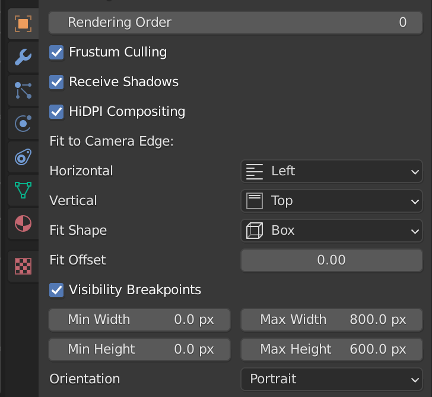
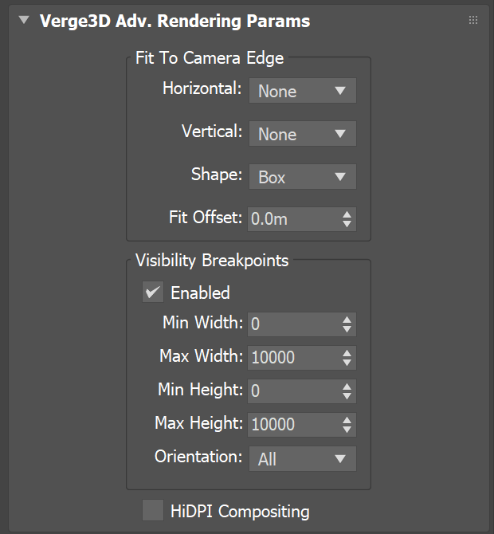
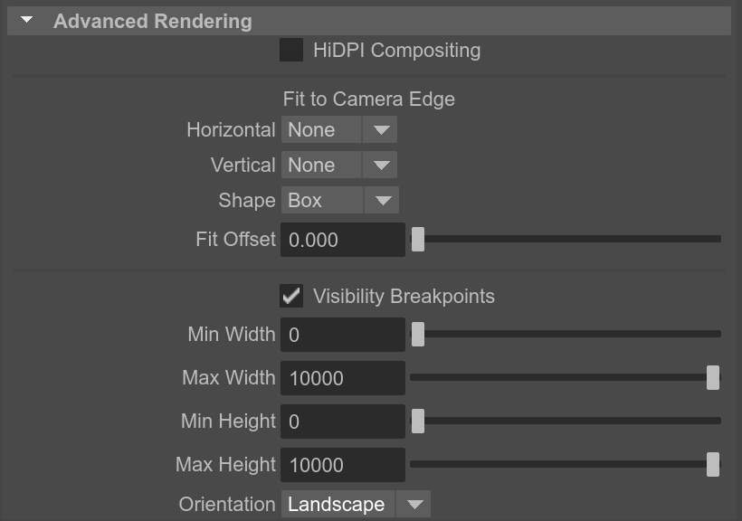
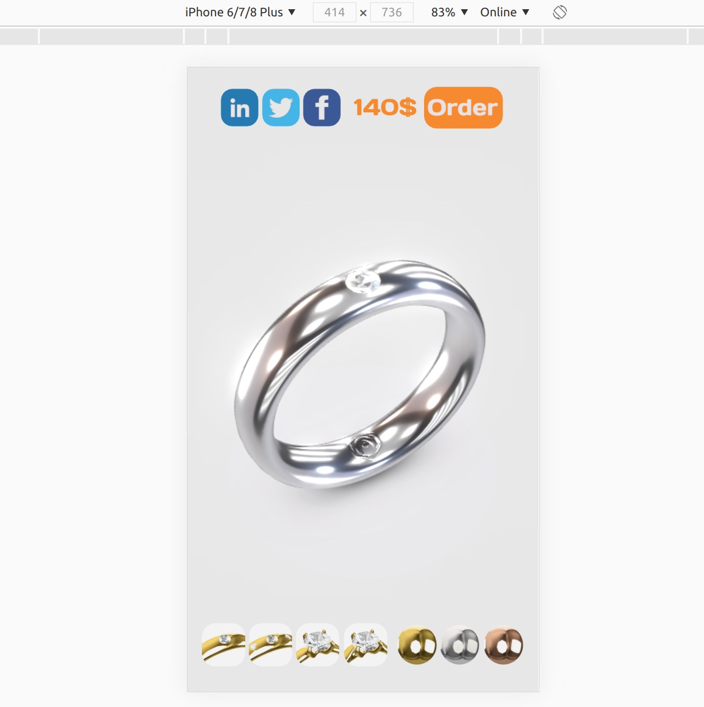
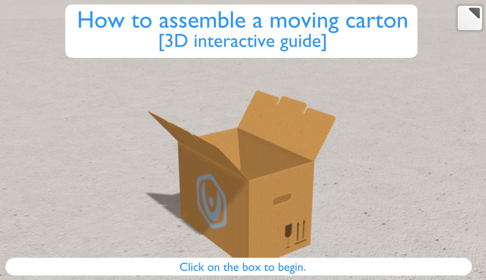
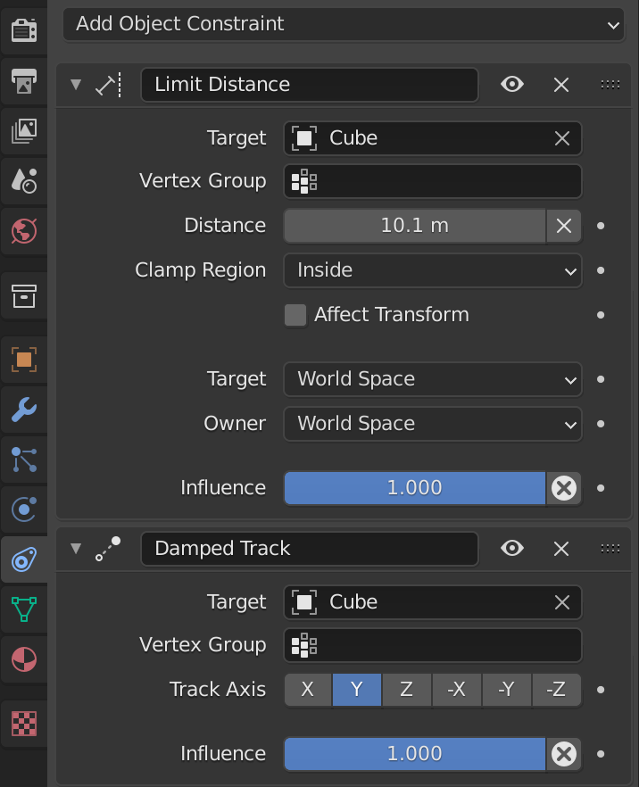
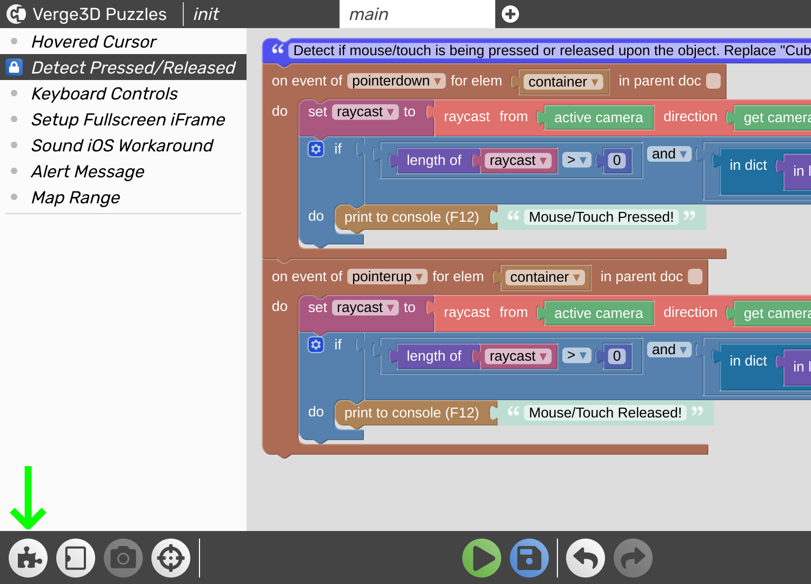
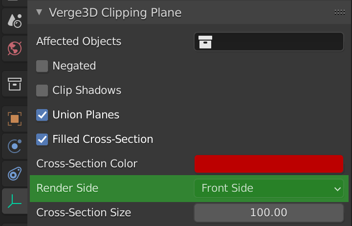
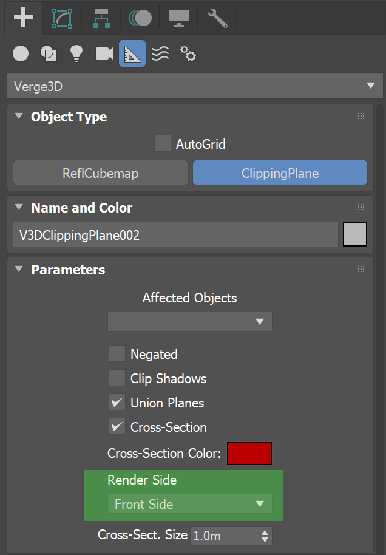
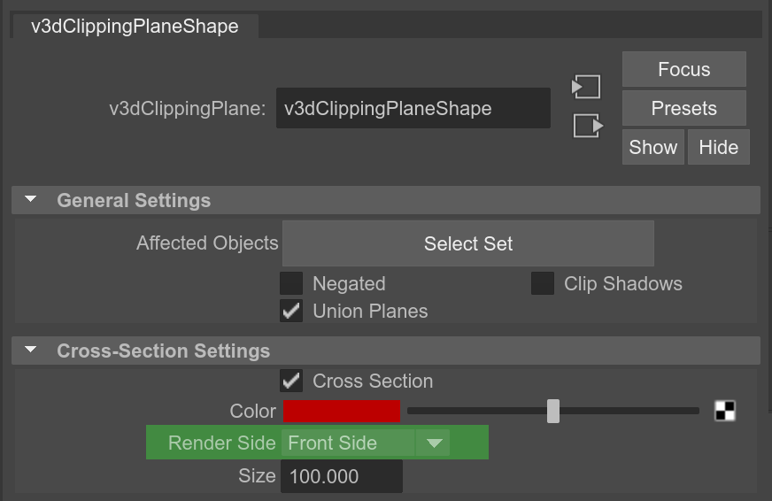

# Verge3D 3.8 pre3预览版发布

Verge3D 3.8的第三个预览版本已经发布！它为高效、独立于分辨率的3D用户界面带来了新的功能，支持了Blender中的几个新对象约束和设置，新增和改进了部分拼图条目，以及对旧式浏览器的支持。 一起来看看吧：

## 重新审视3D用户界面

在早期的Verge3D版本我们曾建议将按钮、面板、滑块或文本标签使用摄影机的3D子对象来实现。之后，我们引入了_HTML拼图_，转而推荐[基于Web的方法](https://www.soft8soft.com/docs/manual/zh/introduction/HTML-based-user-interfaces.html)构建UI/UX（例如使用Webflow等第三方工具）。现在到了重新审视3D用户界面的时候了，我们将为Verge3D带来3个改变游戏规则的功能特性。

Blender:

3ds Max:

Maya:

第一个功能特性可以将3D对象粘贴到视窗边缘。新引进的设置 _Fit to Camera Edge(适应摄影机边缘)_ ，将在对象设置为摄影机的子对象后变得可见，从而精确地实现此功能。它提供了4个参数 – _Horizontal(水平)_, _Vertical(垂直)_, _Fit Shape(适应形状)_, 和 _Fit Offset(适应偏移)_ – 无论屏幕分辨率或设备如何，您都可以使用它将面板或文本附加到预期的位置。

第二个功能特性是 _Visibility Breakpoints(可见性断点)_ 。类似于[CSS断点](https://en.wikipedia.org/wiki/Responsive_web_design)，它们允许您为不同的屏幕分辨率或移动设备方向（横向/纵向）显示不同的对象集。同样，它也可以用来重新排列UI。

第三个对构建UI有帮助的功能特性是 _HiDPI Compositing(HiDPI合成)_ 。它允许您使用单独的高分辨率渲染通道来渲染对象（包括其子对象）。因此，您可以用它来显著提高应用在HiDPI屏幕上的质量，例如视网膜显示器和大多数移动设备。当渲染文本对象，或任何其他需要锋锐且精确的元素时，这可能尤其重要。

我们建议仅为使用简单着色器（例如 _自发光_ ）的对象或小对象使用此功能，以避免过高的性能消耗。

我们改进了旧的演示案例应用 – [E-learning](https://cdn.soft8soft.com/demo/player/player.html?load=../applications/e-learning/e-learning.gltf&logic=../applications/e-learning/visual_logic.js), 和 [Ring](https://cdn.soft8soft.com/demo/player/player.html?load=../applications/ring/ring.gltf&logic=../applications/ring/visual_logic.js) – 为UI对象使用了 _Fit to Camera Edge(适应摄影机边缘)_ 和 _HiDPI Compositing(HiDPI合成)_ 拼图。它们现在看起来更加清晰！

那么，为什么要使用3D用户界面，以及在什么情形下使用3D用户界面呢？毫无疑问，这种方法比使用HTML/CSS更适合3D艺术家，并且不需要外部工具。但它还有更多优点：由于UI元素是真正的3D对象，您可以为其使用着色器、灯光、动画、变形等——尽可大胆想象——使它们真正交互、无缝地集成到场景中。与基于HTML/CSS的方法相比，这可能会产生更吸引人和更有趣的效果。

## Blender专属特性

本次更新引入了一些新的实用的约束，并支持其他一些现有约束的设置。

新的约束有 _Limit Distance(限制距离)_ ，您可以使用 _Clamp Region(钳制范围)_ 的所有选项，_Distance(距离)_ ，以及 _Influence(影响)_ 参数；还有 _Damped Track(阻尼跟踪)_ ，支持其所有参数。

_Copy Transform(复制变换)_ 现在提供 _Mix(混合)_ 的所有选项及 _Influence(影响)_ 的参数。_Copy Rotation(复制旋转)_ 约束现在可用 _Influence(影响)_ 参数和 _Mix(混合)_ 参数的3个选项——_Replace(替换)_, _Before Original(初始前)_, 和 _After Original(初始后)_ 。
_Copy Scale(复制缩放)_ 现在可以使用如下参数： _Axis(轴向)_, _Power(幂)_, _Make Uniform(使一致)_, _Offset(偏移)_, _Additive(添加)_, 和 _Influence(影响)_ 。

## 3ds Max专属特性

调整并重新排布了Verge3D相关的设置和选项，使它们更加紧凑，并与3ds Max的原生UI保持一致。

## Maya专属特性

支持了Maya中通过 _File(文件)_ 节点处理透明度的方式。因此，如果原始图像中没有提供alpha通道（如JPEG），将使用 _基于亮度的Alpha通道(luminance-based alpha channel)_ 。

## 拼图

_comment(注释)_ 拼图的最大长度从50个字符增加到120个字符。

_拼图库_ 中新增一个条目：_Detect Pressed / Released(检测按下或释放)_ 。这一拼图组合可在实现与3D UI元素交互的设计情境中派上用场。一般情况下，它用于检测在选定的对象上的光标或触摸是否被按下或释放。

此外，对拼图库中的其他一些条目进行了简化与注释，以使其更明了。

## 旧式浏览器

我们创建了引擎运行时的一个变体，专门用于支持旧式浏览器，如 _Internet Explorer 11_ 或在非常早期的iPhone与iPad上运行的 _Safari_ 。当在应用创建界面勾选IE11支持选项时，应用将使用此运行时（_v3d.legacy.js_）。请注意，此运行时变体非常笨重和迟缓。而默认的Verge3D运行时则更加紧凑，速度也快得多，并且适用于当今99%的浏览器。

## 其他改进

为之前引入的 _Clipping Planes(裁剪平面)_ 功能增加了一个新的参数 – _Render Side(渲染面)_  ，可用选项为 _Front(前面)_ , _Back(背面)_ , 和 _Double-sided(双面)_ 。可用于指定渲染复杂几何图形的切面与孔。

Blender:

3ds Max:

Maya:

