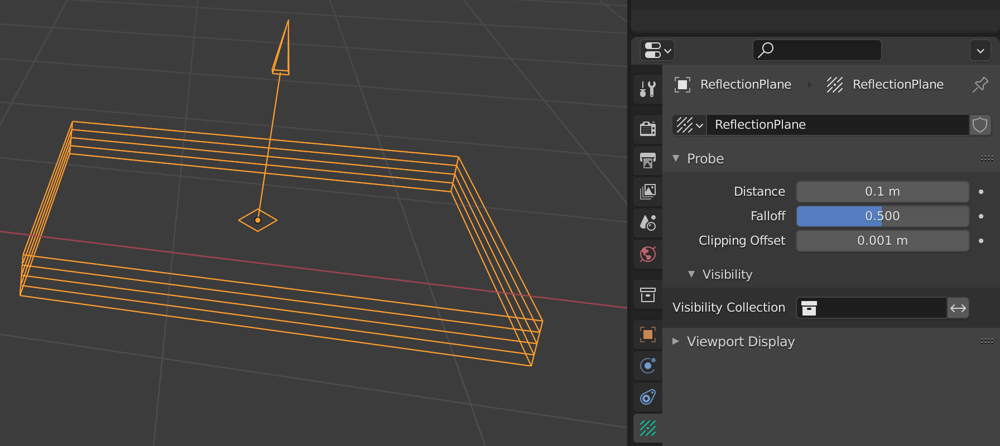
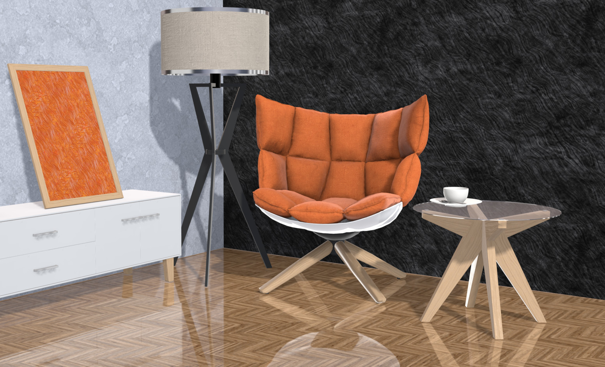
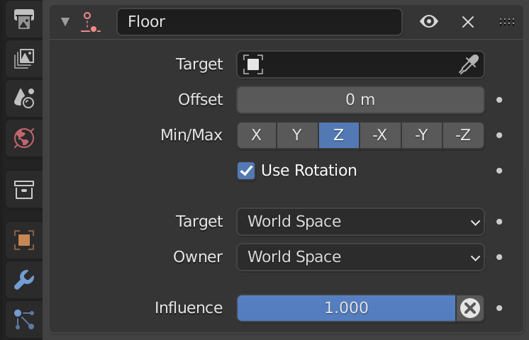
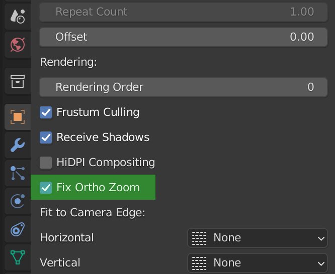
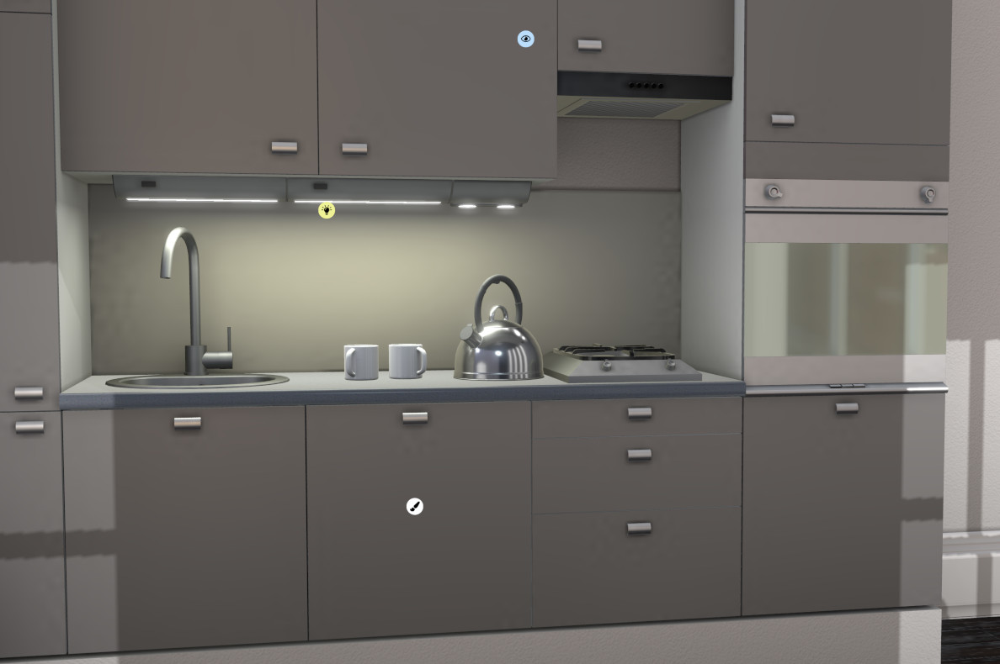
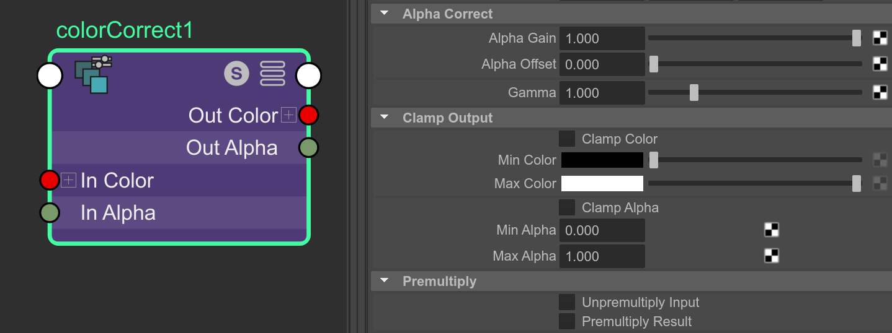
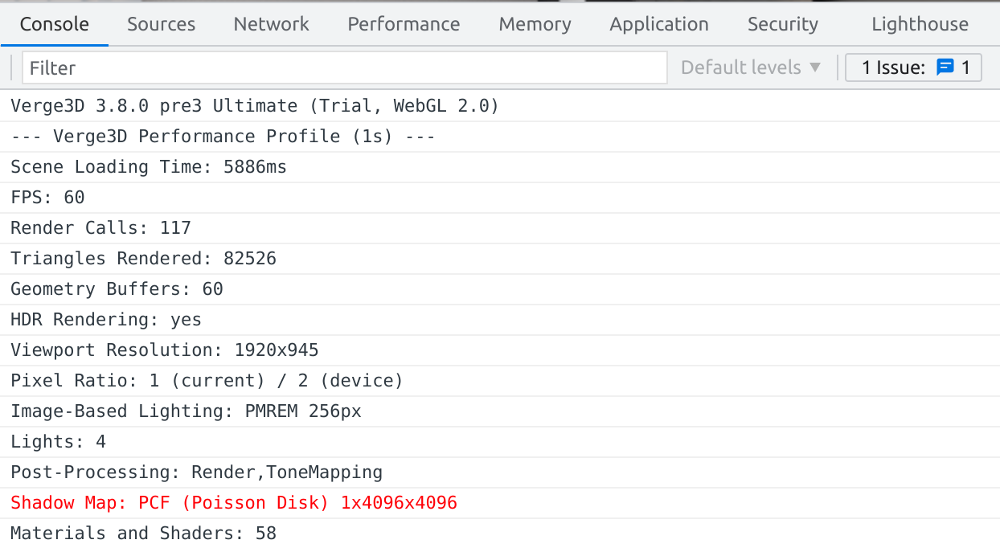
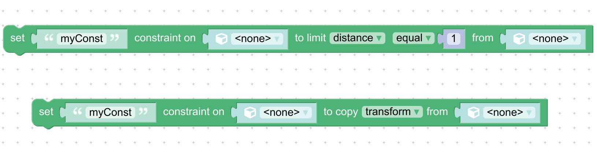

# Verge3D 3.8 pre4预览版发布

## Blender专属特性

Verge3D现在可以使用_光照探头_的_反射平面_类了，并支持Blender提供的所有设置。得益于此，现在可以您可以应用中实现实时的镜面反射或地板反射了。

请查看最新的[Load Unload(加载与卸载)](https://cdn.soft8soft.com/demo/applications/load_unload/load_unload.html)演示案例。

我们已经升级了_Floor(基面)_约束-它现在可以用于倾斜的表面，这得益于对_使用旋转_选项的支持。

了解Verge3D中可用的Blender约束与选项详情请查看[文档相关章节](https://www.soft8soft.com/docs/manual/zh/blender/Object-Constraints.html)。

演示案例_Ring(戒指)_通过使用折射提高了图形效果。同时，为其开启了自动旋转功能。

为_Object Properties(对象属性)_面板添加了一个新设置，名为_Fix Ortho Zoom(固定正射变焦)_.您可以使用它来设置轨道摄影机与其子对象，开启后当用户缩放摄影机时其子对象不会移动。

修复了之前预览版在_Sensor Fit/ Auto_ 中引入的错误选项。

## 3ds Max专属特性

演示案例_Ring(戒指)_通过使用折射提高了图形效果。显示价格功能采用了动态文本。同时，为其开启了自动旋转功能。

## Maya专属特性

之前在Blender和3ds Max中实现的[Global Illumination(全局照明)](https://cdn.soft8soft.com/demo/applications/global_illumination_maya/global_illumination.html)演示案例已在Maya中完成重制。

同时为Maya重制了[Ring(戒指)](https://cdn.soft8soft.com/demo/player/player.html?load=../applications/ring_maya/ring.gltf&logic=../applications/ring_maya/visual_logic.js)演示案例。

节点_colorCorrect(颜色校正)_的所有设置现在都受支持了。

## 其他改进

现在_print performance(打印性能)_拼图（或P-P-P快速键）会输出于可能存在的潜在性能问题。例如，在下面的截图信息中表示，阴影图似乎太大(4K)，这可能会导致渲染变慢。

基于在WebGL着色器中使用了简化的sRGB转换技术，优化了Intel硬件上的引擎性能。

删除了未使用的JS代码和着色器，优化了引擎运行时(v3d.js)的文件大小。

提高了_FXAA_运行于在HiDPI显示设备时的显示质量。

为_limit constraint(约束)_和_copy constraint(复制约束)_拼图分别增加了_distance(距离)_和_copy(复制)_选项。

由于使用了加速结构，_Ray casting(光线投射)_（用于 when clicked，when hovered 和 ray cast 拼图）现在在针对 _批处理几何对象_（通过applying batch geometry 拼图获得）工作起来明显更快。

提高了_HiDPI_渲染的稳定性。

修复了拼图 _add annotation(添加标注)_ - 其_name_ 字段现在可在所有情形中使用。

修复了在iOS11-12旧版本系统的引擎崩溃问题。另外，USDZ导出器现在也可以在IOS12-13系统上正常运行了。
