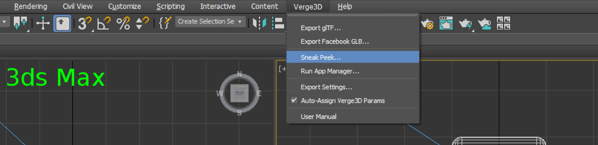
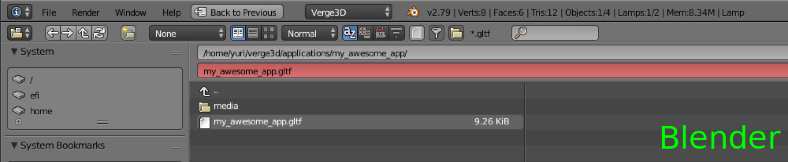

# 初学指南

Verge3D is a versatile piece of software which you can utilize differently depending on your personal preferences. This guide describes just one of possible ways of how you can build your workflow, so take it as a friendly recommendation. The only prerequisite is that you should have some experience with 3D editing software on top of which Verge3D works: Autodesk 3ds Max or Blender.

Verge3D是一款多功能的软件，您可以根据个人喜好来进行不同用途的应用。本指南仅介绍了如何构建工作流程的可能方法之一，因此请将其看作一种友好的推荐。唯一的先决条件是您应该具备3D编辑软件（Verge3D载体）Autodesk 3ds Max或者Blender的使用经验，。

### 安装（Installation）

The installation procedure is throughly described in the corresponding sections for each supported 3D suite individually: [3ds Max](https://docs.eightest.com/getting-started/installation-verge3d-for-3ds-max), [Blender](https://docs.eightest.com/getting-started/installation-verge3d-for-blender).

安装过程在对应支持的3D编辑软件中分别逐步介绍：[3ds Max](https://docs.eightest.com/getting-started/installation-verge3d-for-3ds-max)，[Blender](https://www.soft8soft.com/docs/manual/en/introduction/Installation-Blender.html)。

### 预览（Sneak Peek）

To make sure that Verge3D is installed correctly, you can render a basic model in the web browser by using the **Sneak Peek** menu option \(3ds Max\) or button \(Blender\). This function will perform an export to a temporary folder and will run the default web browser with interactive rendering.

要确保已经正确安装Verge3D，您可以使用“Sneak Peek”菜单选项（3ds Max）或按钮（Blender）在Web浏览器中呈现出基本模型。此功能将执行导出到临时文件夹，并将使用交互式渲染方式来运行默认Web浏览器。

You may use Sneak Peek for quick tests any time you are working on your projects.

您可以在任何时候进行项目时使用Sneak Peek进行快速测试。

### 应用管理（App Manager）

Although you can start working on graphics first and create a Verge3D project later, we encourage you to get used to the App Manager from the beginning. By doing so you ensure that your files are properly organized and stored within the same folder which is important for integrity of your project, and especially for publishing. You will also have a working web application which you can run/reload in the browser independently from your source scene files.

虽然您可以先开始处理图形并稍后创建Verge3D项目，但我们建议您从一开始就使用App Manager。通过这样做，您可以确保正确组织文件并将其存储在同一文件夹中，这对项目的完整性非常重要，特别是对于发布。您还将拥有一个可用的Web应用程序，您可以在浏览器中独立于源场景文件运行/重新加载。

The App Manager as a web-based tool which opens up in the browser when you select the App Manager option in the Verge3D menu \(3ds Max\) or click the same-name button \(Blender\). The default system browser will be running - you can change it in your OS settings. Any modern browser will work yet we recommend the latest version of Google Chrome which is fast, standards-compliant and offers good web development tools.

App Manager作为基于Web的工具，当您在Verge3D菜单（3ds Max）中选择App Manager选项或单击同名按钮（Blender）时，该工具将在浏览器中打开。默认系统浏览器将运行 - 您可以在操作系统设置中更改它。任何当下的浏览器都可以使用，我们推荐最新版本的谷歌浏览器，它快速，标准同时提供良好的网络开发工具。

You can create a new project using the panel on the right. Type a project name \(or just leave my\_awesome\_app\) and click Create App. Leave the default configuration options as they are for now.

您可以使用右侧的面板创建新项目。键入项目名称（或只保留my\_awesome\_app），然后单击“ 创建应用程序”。暂时保留默认配置选项。

As a result, a folder named after your app will be created inside the applications folder of your Verge3D installation. It is important to know where your app folder is because all your textures and other project assets should be stored here.

因此，将在Verge3D安装的applications文件夹中创建以您的应用程序命名的文件夹。了解app文件夹的位置非常重要，因为所有纹理和其他项目资产都应存储在此处。

After you created a project, return to the main screen of the App Manager - your project should be listed there. Now you can proceed with your app in several directions, by simply running it, authoring the graphics, creating interactive scenarios and eventually, publishing.

创建项目后，返回到App Manager的主屏幕 - 您的项目应该列在那里。现在，您可以通过简单地运行，创作图形，创建交互式场景以及最终发布等操作，在多个方向上继续您的应用。

You may also check out the following videos explaining how to create a new Verge3D project with the App Manager: [3ds Max](https://www.youtube.com/watch?v=99swwn8kpCo), [Blender](https://www.youtube.com/watch?v=ibPSGArAfJM).

您还可以查看以下视频，了解如何使用App Manager创建新的Verge3D项目：[3ds Max](https://www.youtube.com/watch?v=99swwn8kpCo)，[Blender](https://www.youtube.com/watch?v=ibPSGArAfJM)。

### 运行你的应用（Running Your App）

You can run your app any time by clicking the Verge3D icons, either the blue or the green one. The blue icon launches an app in its final form, with its Puzzles scenario and the programming code \(if present\). On the contrary, the green icon only opens the exported scene.

您可以通过单击Verge3D图标（蓝色或绿色图标）随时运行您的应用程序。蓝色图标以最终形式启动应用程序，其中包含Puzzles场景和编程代码（如果存在）。相反，绿色图标仅打开导出的场景。

A freshly created app loads and displays just a cube. You can look around with the left mouse button pressed, and zoom in and out with the mouse wheel. 

新创建的应用程序加载并显示一个立方体。您可以按下鼠标左键环顾四周，然后使用鼠标滚轮放大和缩小。

If instead it shows something like "This site can’t be reached" this means that you accidentally closed your 3D editor and the development server along with it. In this case you should launch 3ds Max or Blender again.

相反，如果显示“无法访问此站点”，则表示您意外关闭了3D编辑器和开发服务器。在这种情况下，您应该再次启动3ds Max或Blender。

Although very rare, another warning can be shown: "Your graphics card does not seem to support WebGL." This can happen if you're using an outdated or unsupported browser such as Internet Explorer below version 11, or your video card and/or drivers are blacklisted by the browser. Try installing latest Google Chrome/updating your OS/downloading latest drivers or just find another computer to work on.

虽然非常少见，但也可能显示另一个警告：“您的图形卡似乎不支持WebGL。”如果您使用的是过时或不受支持的浏览器（如版本11以下的Internet Explorer），或者您的显卡和/或驱动程序被浏览器列入黑名单，则可能会发生这种情况。尝试安装最新的谷歌浏览器/更新您的操作系统/下载最新的驱动程序或干脆找另一台计算机。

### 输出（Export）

By clicking on the 3ds Max or Blender icon you can open up the main .max or .blend file of your application respectively.

通过单击3ds Max或Blender图标，您可以分别打开应用程序的.max或.blend文件。

The 3D editor files can be also opened as usual via the "File &gt; Open" dialog or simply by double-clicking on them in the application folder.

3D编辑器文件也可以像往常一样通过“文件&gt;打开”对话框打开，或者只需在应用程序文件夹中双击它们即可。

It is important to understand that an application loads only exported scenes and not the source 3D editor files.So every time you change something in your source file you should export it in order to see the changes in your app. Exporting can be performed from the Verge3D menu of the main menu bar \(in 3ds Max\) or from the File &gt; Export menu \(in Blender\). You might want to assign a shortcut for this operation since you may perform it quite often.

重要的是要了解应用程序仅加载导出的场景而不加载源3D编辑器文件。因此，每次更改源文件中的内容时，都应导出它以便查看应用程序中的更改。可以从主菜单栏的Verge3D菜单（在3ds Max中）或从文件&gt;导出菜单（在Blender中）执行导出。您可能希望为此操作指定快捷方式，因为您可能会经常执行此操作。

You can export your scene file right to the root of the application folder, in glTF format.

您应该以glTF格式将场景导出到应用程序文件夹的根目录。

To test it out, add some teapots/Suzannes to your scene, export to glTF and run your app by clicking the blue Verge3D logo icon in the App Manager.

要测试它，在场景中添加一些茶壶/ Suzannes（金属猴头），导出到glTF并通过单击App Manager中的蓝色Verge3D图标来运行您的应用程序。

For quicker iterations, you can keep your application always running in a browser tab. Hit "F5" on your keyboard after you re-export your scene so that it reloads in the browser. Use the "Alt+Tab" \("Command+Tab" on Mac\) shortcut to instantly switch between your 3D editor and the browser.

为了更快地进行迭代，您可以使应用程序始终在浏览器选项卡中运行。 重新导出场景后，在键盘上按“F5”，以便在浏览器中重新加载。 使用“Alt + Tab”（Mac上的“Command + Tab”）快捷键可立即在3D编辑器和浏览器之间切换。

### 拼图编辑器（Puzzles）

Until now we used Verge3D as a fancy web exporter, which generates live 3D views running in the browser. With Puzzles, Verge3D's visual scripting tool, you can add behavior scenarios so that your 3D scene becomes a truly interactive web application.

到目前为止，我们使用Verge3D作为一个优秀的Web导出器，它可以生成在浏览器中运行的实时3D视图。借助Verge3D的可视化脚本工具Puzzles，您可以添加行为场景，以便您的3D场景成为真正的交互式Web应用程序。

Click the Puzzles button near your app name in the App Manager. This will run your app with the Puzzles editor attached on top of it. On the left the toolbox with some categories \("Events", "Selectors", "Objects", etc\) is located. The categories are expanded upon mouse click revealing puzzles which you can drag out to the workspace. By connecting various puzzles with each other you can create a scenario of how your 3D objects will behave upon user input.

单击应用程序管理器中应用程序名称旁边的“拼图”按钮。这将运行你的应用程序与它上面的拼图编辑器。在左侧，工具箱中包含一些类别（“事件”，“选择器”，“对象”等）。通过鼠标单击打开拼图可以扩展类别，您可以将其拖出到工作区。通过将各种谜题相互连接，您可以创建3D对象在用户输入时的行为方式。

To do something meaningful for the beginning, drag out the when clicked puzzle from the Events category, and the select an object puzzle from the Selectors.

要在开始时执行有意义的操作，请从“Events”类别中拖出When clicked拼图，然后从“Selectors”中选择一个object拼图（Camera）。

Connecting them together means that you app will be waiting until the user clicks on the object that you chose in the dropdown menu \("Cube", for example\), and will do... nothing unless you add something in the do slot.

将它们连接在一起意味着您的应用程序将等待用户单击您在下拉菜单中选择的对象（例如，“立方体”），并且除非您在do插槽中添加内容，否则将不会执行任何操作。

Drag out the hide puzzle from the Objects and insert it to that slot. Drag out another object selector puzzle and connect it with hide.

从Objects中拖出hide拼图并将其插入该插槽。从Selector类别中拖出另一个object并将其与hide连接。

Now, once the user clicks on the 3D object, it it should disappear. Click the Run button in order to launch your program and check if it works by clicking on the cube.

现在，一旦用户点击3D对象，它就会消失。单击“运行”按钮以启动程序，并通过单击立方体来检查它是否有效。

In order to make your scenario a persistent part of your application, be sure to save it.

为了使您的场景成为您应用程序的一部分，请确认保存它。

Once you finished with Puzzles, you can run your now-interactive app using the blue icon in the App Manager. Congratulations, you have become a programmer! 

完成拼图后，您可以使用App Manager中的蓝色图标运行现在的交互式应用程序。恭喜你，你已成为一名程序员！

You may also check out the following videos explaining how to work with the Puzzles: [3ds Max](https://www.youtube.com/watch?v=Jsfqd9CIwqQ), [Blender](https://www.youtube.com/watch?v=u-a_TJKQ8oQ).

您还可以查看以下视频，了解如何使用拼图： [3ds Max](https://www.youtube.com/watch?v=Jsfqd9CIwqQ)，[Blender](https://www.youtube.com/watch?v=u-a_TJKQ8oQ)。

### 发布

**On your own website...**

You've created a web application and probably want the billions of Internet users to come and check it out. If you own a website, this won't be a problem - simply upload the entire folder with your application to your server \(via FTP, for example\). Once deployed, you can provide a link to the app's HTML file somewhere on your website, or embed it in a web page with the iframe HTML element:

**在您自己的网站上......** 

您已经创建了一个Web应用程序，可能希望数十亿的Internet用户来查看它。如果您拥有一个网站，这不会是一个问题 - 只需将您的应用程序的整个文件夹上传到您的服务器（例如，通过FTP）。部署后，您可以在网站上的某个位置提供应用HTML文件的链接，或将其嵌入带有iframe HTML元素的网页中：

`<iframe width="1024" height="640" allowfullscreen src="https://www.example.com/my_awesome_app/my_awesome_app.html"></iframe>`

**Using Wordpress...** 

The task is even more simplified if you are running the Wordpress CMS on your website - you can use the free Verge3D Wordpress plugin to upload and embed Verge3D apps.

**使用Wordpress ...** 

如果您在网站上运行Wordpress CMS，则任务更加简化 - 您可以使用免费的Verge3D Wordpress插件上传和嵌入Verge3D应用程序。

**On Verge3D Network...** 

But what if you haven't had the chance to become a web master? No problem - by clicking the "Globe" button in the App Manager you can upload your app to the Verge3D Network, a cloud-based storage and CDN hosted on Amazon servers.

**在Verge3D网络上......**

 但是如果你没有机会成为一名网络大师呢？没问题 - 通过单击App Manager中的“Globe”按钮，您可以将应用程序上传到Verge3D Network，这是一个基于云的存储和托管在Amazon服务器上的CDN。

After the uploading is complete, a screen will show up with a direct link which you can share by whatever means \(in a blog post, social media, comments, email, you name it\). It will also generate HTML code for embedding your app in third-party websites just like you do it with YouTube videos.

上传完成后，屏幕将显示一个直接链接，您可以通过任何方式共享（在博客文章，社交媒体，评论，电子邮件，您的名字）。它还会生成HTML代码，以便将您的应用嵌入第三方网站，就像使用YouTube视频一样。

You may also check out the following videos explaining how to publish your app on Verge3D Network: [3ds Max](https://www.youtube.com/watch?v=d5cPnnblV30), [Blender](https://www.youtube.com/watch?v=Uf5wuLlyn-k).

您还可以查看以下视频，了解如何在Verge3D Network上发布您的应用：[3ds Max](https://www.youtube.com/watch?v=d5cPnnblV30)**，**[Blender](https://www.youtube.com/watch?v=Uf5wuLlyn-k)。

**On Facebook...** 

Finally, you can post a 3D model directly on Facebook by leveraging the 3D Posts feature.

**在脸书上...** 

最后，您可以通过利用3D帖子功能直接在Facebook上发布3D模型。

### 授权码

After acquiring a license, you'll be sent the license information in an email \(the key below is a random example\).

获得许可证后，您将通过电子邮件收到许可证信息（下面的密钥是随机示例）。

The license key will activate your Verge3D instance and will remove the trial watermark from all your apps.

许可证密钥将激活您的Verge3D实例，并将从您的所有应用程序中删除试用水印。

Be sure to enter the license key each time you update to a new version.

每次更新到新版本时，请务必输入许可证密钥。

### 未完待续（What's Next）

For more detailed information check out the other topics from this User Manual. We also invite you join Soft8Soft [community forums](https://www.soft8soft.com/forums/) where we'd be happy to answer all your questions.

有关更多详细信息，请查看本用户手册中的其他主题。我们还邀请您加入[Soft8Soft社区论坛](https://www.soft8soft.com/forums/)，我们很乐意回答您的所有问题。

