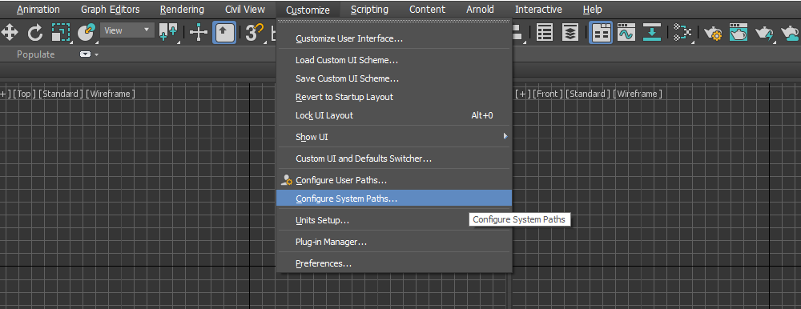

# Installation - Verge3D for 3ds Max

Verge3D can run on top of Autodesk 3ds Max 2019 to 2015 which should be installed first. If this is not the case, you can download a free trial bundle from Autodesk's [website](https://www.autodesk.com/products/3ds-max/free-trial), or try Verge3D for Blender instead.[Download Verge3D](https://www.soft8soft.com/get-verge3d/) and run the **.exe** file so that unpacks to a directory of your choice. Make sure you have enough permissions to read/write in this folder. Installing in a system directory such as "Program Files" is not recommended.Run 3ds Max, and select "Configure System Paths..." under "Customize" in the main menu bar.

Switch to the "3rd Party Plug-ins" tab and click the "Add..." button.

Navigate to the folder in which Verge3D is installed and then to the "max\_plugin" folder inside it. Click "Use Path".

Click "OK" and **re-open 3ds Max**.

Installation complete. Now you should see "Verge3D" in the main menu bar.

### Troubleshooting

In some cases the Verge3D menu does not show up in the main menu bar. To register the menu manually, go to "Utilities", click "MaxScript" and select "Verge3D" in the dropdown menu. Then click "Register Verge3D menu".

### What's Next

[Familiarize yourself with the basics.](../)

